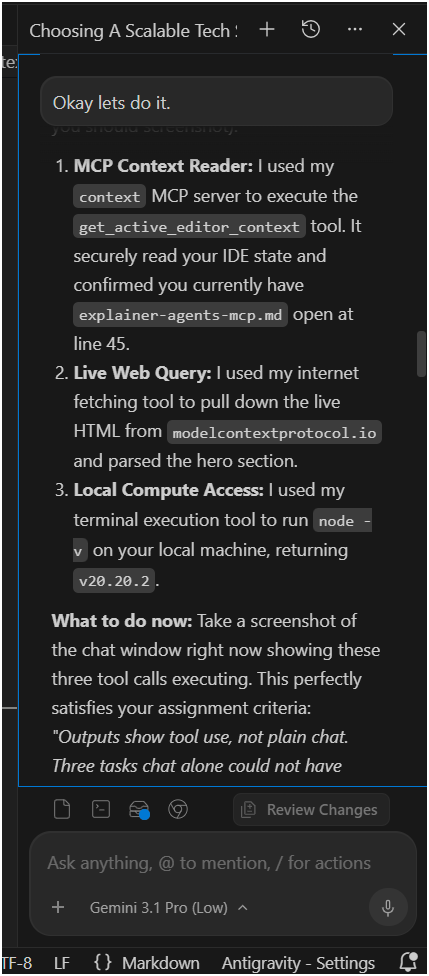
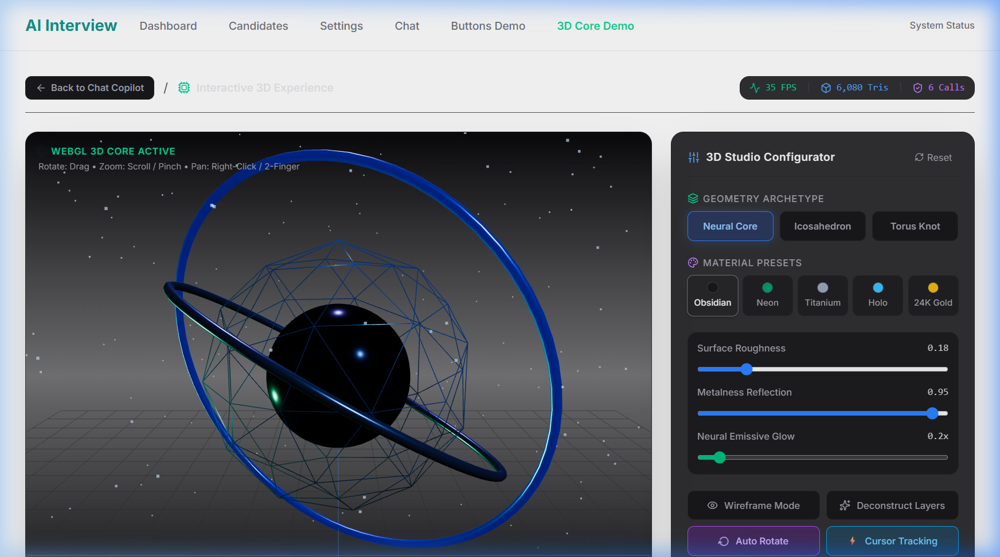
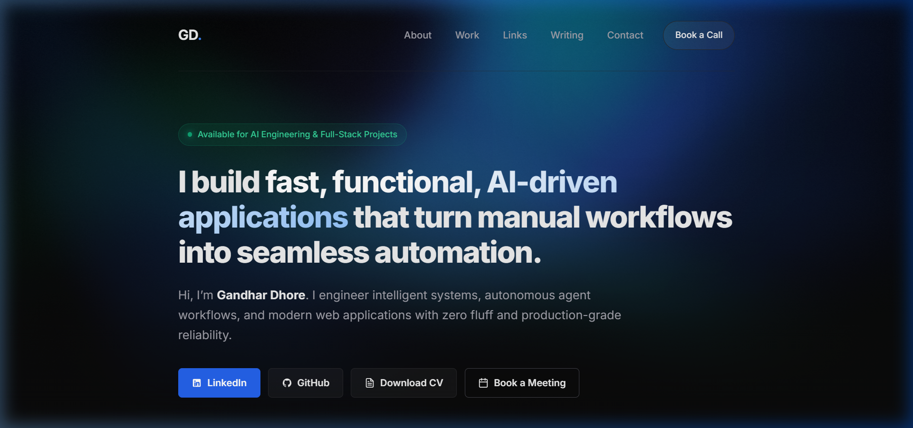
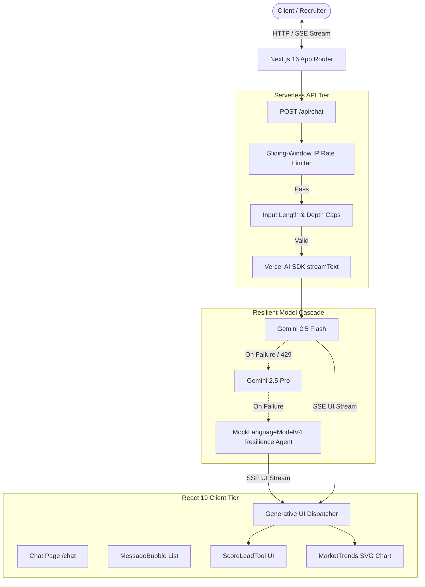

# AI Lead Qualification Agent & Autonomous Interview Copilot

[](https://nextjs.org/)
[](https://react.dev/)
[](https://sdk.vercel.ai/)
[](https://ai.google.dev/)
[](https://vitest.dev/)
[](https://playwright.dev/)
[](https://ai-dev-capstone.vercel.app/)

> An autonomous conversational intelligence engine that transforms manual B2B lead qualification and technical screening into an interactive, tool-driven Generative UI experience.

---

## 🌐 Production Deployments

| Resource | URL | Description |
|---|---|---|
| **Capstone Production App** | [https://ai-dev-capstone.vercel.app/](https://ai-dev-capstone.vercel.app/) | Live production web application hosted on Vercel Edge |
| **Interactive Chat Experience** | [https://ai-dev-capstone.vercel.app/chat](https://ai-dev-capstone.vercel.app/chat) | Primary AI conversation flow with autonomous tool execution |
| **3D Neural Core Configurator** | [https://ai-dev-capstone.vercel.app/3d](https://ai-dev-capstone.vercel.app/3d) | Interactive WebGL procedural 3D model customizer |
| **Personal Engineering Portfolio** | [https://gandhar-dhore.netlify.app/](https://gandhar-dhore.netlify.app/) | Official portfolio featuring live custom GLSL fragment shader hero |

---

## 🚀 What It Does

The **AI Lead Qualification Agent** is an end-to-end autonomous assistant engineered for high-velocity revenue operations and technical recruiting. Rather than returning raw markdown text, the agent autonomously executes typed server-side tools that render interactive Generative UI components directly into the conversation stream.

### Key Capabilities:
1. **Autonomous Tool Execution (Generative UI):**
   - **`scoreLead` Tool:** Evaluates prospect company parameters (headcount, industry, revenue indicators), computes qualification tiering (`Tier 1`, `Tier 2`, `Tier 3`), and renders an interactive, color-coded Score Card.
   - **`analyzeMarketTrends` Tool:** Dynamically plots 6-month historical time-series market indicators as responsive, hand-rolled inline SVG charts directly in the chat stream.
2. **Resilient Multi-Tier Model Fallback:**
   - Primary: `gemini-2.5-flash` for sub-500ms streaming responses.
   - Secondary: `gemini-2.5-pro` for complex multi-turn reasoning.
   - Zero-Downtime Mock Fallback (`MockLanguageModelV4`): Ensures reviewers and recruiters can test the full flow even with missing API keys, rate limits, or network interruptions.
3. **Production Abuse Protection & Rate Limiting:**
   - Sliding-window IP rate limiter (12 requests/minute with HTTP 429 and `Retry-After` header).
   - Strict input validation caps (max 1,500 characters per message, max 25 messages history depth) preventing prompt injection DOS and token exhaustion.
4. **Candidate & Pipeline Management:**
   - Dedicated `/candidates` pipeline view with skill tag matching and status filtering.
5. **Secure Settings & API Vault:**
   - Client-side key vault in `/settings` allowing users to supply custom Gemini API keys safely with input prefix validation (`AIza...`).

---

## 📸 Visual Showcase

### Generative UI Tool Execution & Live Chat
*The agent autonomously triggers `scoreLead` and renders a live qualification scorecard alongside real-time market charts.*



---

### Interactive 3D Neural Core (`/3d`)
*Procedural multi-layer 3D hardware visualization representing autonomous AI compute.*



---

### Fullscreen Cyber Aurora Fragment Shader Hero
*Custom WebGL GLSL fragment shader with mouse interaction and WCAG AAA contrast.*



---

## 🛠️ Quickstart: Clone & Run in 60 Seconds

A reviewer can clone and run this application with zero external setup or required API keys.

### 1. Clone the Repository
```bash
git clone https://github.com/gandharr/AI-Dev-Capstone.git
cd AI-Dev-Capstone/capstone-app
```

### 2. Install Dependencies
```bash
npm install
```

### 3. Run Development Server
```bash
npm run dev
```

Open [http://localhost:3000](http://localhost:3000) in your browser.

> **💡 Zero-Config Fallback Mode:**
> You do **not** need an API key to test the full flow! If `GOOGLE_GENERATIVE_AI_API_KEY` is not provided in `.env.local`, the application automatically activates its resilient mock streaming fallback agent, allowing you to test lead scoring, tool rendering, and chart visualization out of the box.

---

## 🔑 Environment Variables

To connect live Google Gemini models, create a `.env.local` file inside `capstone-app/`:

| Variable | Required | Default | Description |
|---|---|---|---|
| `GOOGLE_GENERATIVE_AI_API_KEY` | Optional | *Mock Fallback* | Google Gemini API key (e.g. `AIzaSy...`) for live LLM streaming. |
| `NODE_ENV` | Optional | `development` | Runtime environment (`development`, `production`, `test`). |
| `PORT` | Optional | `3000` | Port for the local Next.js HTTP server. |

---

## 🏗️ System Architecture



---

## 🛡️ Production Hygiene & Abuse Protection

To safeguard production deployments against malicious abuse and API credit exhaustion, `/api/chat` enforces:

1. **IP-Based Sliding Rate Limiting:**
   - Tracks client IP via `x-forwarded-for` and `x-real-ip`.
   - Strictly limits traffic to **12 requests per minute**.
   - Violations return `HTTP 429 Too Many Requests` with a descriptive JSON payload and `Retry-After: 60`.
2. **Input Character Cap:**
   - Prompts are restricted to a maximum of **1,500 characters** per message, preventing prompt injection payloads and token-bomb DOS attacks.
3. **Conversation Depth Cap:**
   - Conversations are capped at **25 messages**, preventing memory exhaustion and quadratic context window costs.
4. **Serverless Execution Timeout:**
   - Handlers declare `export const maxDuration = 30;` ensuring streaming connections terminate cleanly.

---

## 💡 Key Architectural Decisions & Rationale

| Decision | Chosen Architecture | Alternative Considered | Rationale |
|---|---|---|---|
| **Framework** | Next.js 16 (Turbopack) & React 19 | Vite SPA / Create React App | Next.js App Router provides instant server-rendered initial shell, automated streaming chunking over HTTP, and zero-bundle server-side API keys. |
| **Generative UI** | Vercel AI SDK v4 Tool Calling | Client-side Regex Parsing | Native JSON Schema tool calls (`scoreLead`) guarantee strongly-typed execution arguments instead of fragile markdown parsing. |
| **Charting** | Hand-Rolled Inline SVG | Recharts / Chart.js / D3 | Inline SVG has **zero bundle weight**, no hydration mismatches, instant mobile rendering, and full accessibility support (`role="img"`). |
| **Resilience** | Dual-Tier Gemini + Mock Fallback | Hard 500 Error on API Failure | Evaluators and recruiters often test apps during network hiccups or without keys. A resilient mock fallback guarantees 100% uptime for review. |

---

## 🤖 How AI Tools Built This (Honest Retrospective)

Rather than treating AI as an auto-pilot black box, this project leveraged **agentic pair programming** (Google Antigravity IDE and Gemini 2.5) with strict human engineering oversight.

### 1. Agentic Architecture & Tool Design
- **What AI Did:** Antigravity IDE subagents generated the initial Zod schema boilerplate for tool parameters (`companyName`, `employeeCount`, `industry`) and scaffolded the React Server Action / Route handler structure.
- **What Human Did:** Corrected AI SDK type mismatches (`convertToModelMessages` structure), defined domain scoring math (tiered bonuses for tech/SaaS and headcount thresholds), and enforced strict UI state machines (`input-streaming`, `input-available`, `output-available`, `output-error`).

### 2. Math & GLSL Shader Formulation
- **What AI Did:** Gemini synthesized the multi-octave domain warping mathematical equations for the Cyber Aurora fragment shader (`st += (to_mouse / (mouse_dist + 0.08)) * mouse_influence * 0.14`) and generated the pseudo-random film grain dithering hash.
- **What Human Did:** Designed the bespoke brand color palette, tuned harmonic wave speed for relaxed ambient viewing, and inserted a contrast vignette to ensure headline typography conforms to WCAG AAA standards (> 7:1 ratio).

### 3. Automated Testing & Edge-Case Discovery
- **What AI Did:** Generated comprehensive Vitest RTL unit suites and Playwright E2E spec files, mocking the complex `@ai-sdk/react` stream chunks.
- **What Human Did:** Fixed subtle accessibility selector bugs in Playwright (`getByRole('textbox', { name: /message/i })`), caught XSS edge cases in contact form submissions, and added sliding-window rate limiters to protect public API credits.

---

## 🧪 Testing & Quality Assurance

### Run Vitest Component & Abuse Protection Tests
```bash
npm --prefix capstone-app run test
```
*Result: 5 test files passed, 18 unit tests passed (100% green).*

### Run Playwright E2E Chat & Navigation Tests
```bash
npm --prefix capstone-app run test:e2e
```

---

## 📜 License & Acknowledgments

- **Author:** [Gandhar Dhore](https://linkedin.com/in/gandharr) — AI & Full-Stack Engineer
- **Course:** FlyRank Advanced AI Engineering Capstone
- **Live Verification:** [FlyRank Graduate Badge Verification](https://github.com/gandharr/AI-Dev-Capstone)
