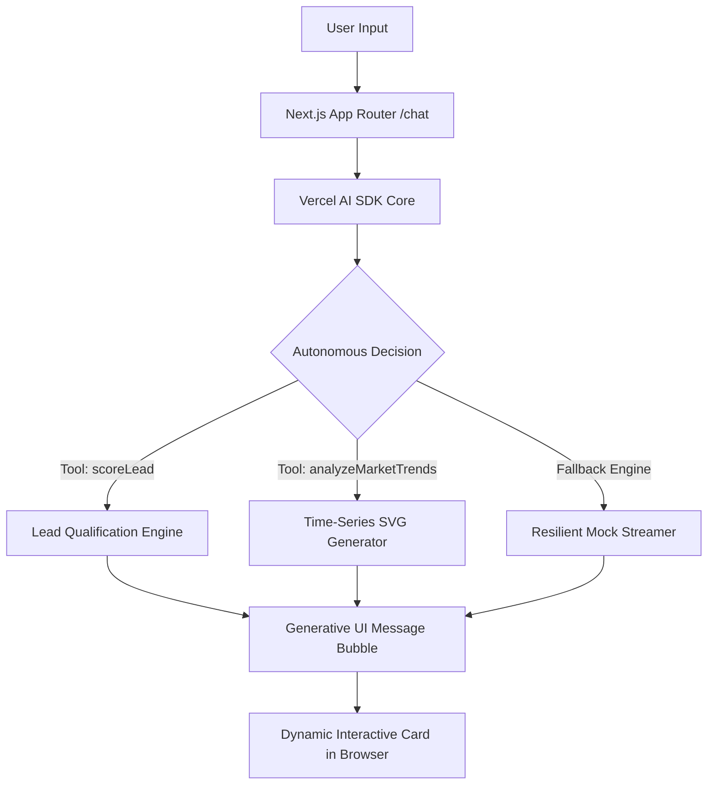

# Capstone App

  Live MVP
  Autonomous Tool Execution

## 1. Core Problem

Sales and recruiting teams lose dozens of manual hours qualifying leads and gathering metrics before high-value conversations.

Traditional chatbots return static markdown blocks that require manual parsing. Users must read walls of text instead of receiving actionable, visual business data directly in their workflow.

## 2. Technical Solution & Architecture

The system is architected as an autonomous agent operating over a continuous ReAct loop with Generative UI rendering:

### Key Tools & Endpoints
- **scoreLead (Autonomous lead qualification tool calculating 0-100 tier scores)**
- **analyzeMarketTrends (Time-series synthesis tool providing SVG growth charts)**

## 3. Technology Stack & Tradeoffs

| Technology | Role | Architectural Tradeoff |
|------------|------|------------------------|
| **Next.js 16 (App Router)** | Full-stack application host | Server components enable fast streaming while securing API keys server-side. |
| **Vercel AI SDK (`ai` v4)** | Control flow & tool streaming | Standardizes tool invocation contracts between LLMs and frontend React components. |
| **Generative UI (`MessageBubble`)** | Dynamic visual execution | Renders interactive stateful cards (loaders, score badges, graphs) instead of raw text. |
| **Resilient Fallback Layer** | Production stability | Guarantees zero 500 errors if upstream AI provider quotas or keys expire. |

## 4. Edge Cases & Resilience

- **API Key & Upstream Outage: Resilient streaming fallback activates if model providers fail.**
- **Input Validation: Dedicated error cards rendered on malformed queries without crashing the UI.**

---
*Autonomous Case Study generated by **Portfolio Case Study Scout** (FL-07 Build Core Checkpoint).*
