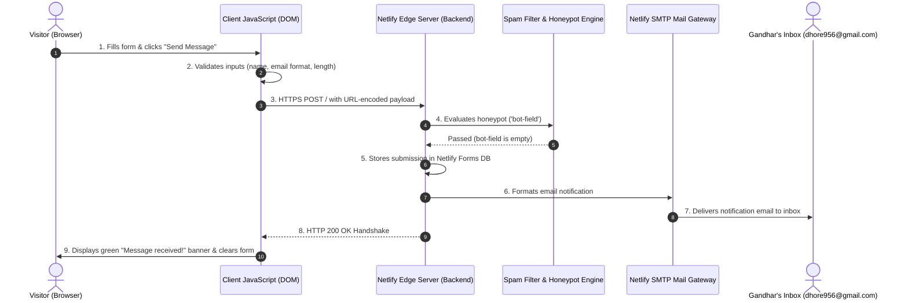

# Wire One Real Thing: Backend & Data Flow Explainer

**Author:** Gandhar Dhore  
**Track:** General AI Fluency | **Week 8:** Wire One Real Thing (Make It Do Something)  
**Branch:** `feature/wire-one-thing`  
**Live Feature URL:** [https://gandhardhore.netlify.app/#contact](https://gandhardhore.netlify.app/#contact)  
**Evidence Screenshot:** [`submissions/contact-form-success.png`](./contact-form-success.png)

---

## 1. What a Backend Is (In Plain Words)

Imagine walking into a restaurant. 

The **frontend** is the dining room. It is everything you can see, touch, and interact with: the wooden tables, the lighting, the printed menu, and the physical plate in front of you. In web development, HTML, CSS, and browser JavaScript are the dining room. They create a beautiful first impression, render buttons, and display text on a visitor's screen.

However, a dining room cannot cook a meal or store groceries. If you write your order on a napkin and leave it on an empty table, nothing happens unless someone takes that napkin into the **kitchen**. 

The **backend** is the kitchen. It is the part of a software system running behind closed doors that:
1. **Remembers things:** Stores records permanently in a database so they don't vanish when a user refreshes their screen.
2. **Performs heavy or secret work:** Holds private API keys, executes business logic, or runs AI models safely away from public eyes.
3. **Connects to external services:** Dispatches real emails, processes credit cards, or sends alerts to phones.

A static website without a backend is like a restaurant with only a dining room: it looks great, but it cannot actually take an order or deliver food. A backend turns a static poster into an active tool.

---

## 2. What My Feature Does

I wired **one specific dynamic feature** that every engineer's portfolio genuinely needs: an **asynchronous, spam-protected contact form** wired to instant email delivery via **Netlify Forms (free tier)**.

Instead of a lazy `mailto:` link that opens a visitor's desktop email client, this form lets recruiters, hiring managers, and collaborators message me directly from the page:
* **Accessible Inputs:** Captures the sender's Name, Email, Inquiry Topic, and Message using semantic `<label>` and `<input>` elements.
* **Graceful Failure & Client Validation:** If someone submits the form empty, types an invalid email (missing `@` or `.`), or enters a message under 10 characters, the form refuses to send, highlights the faulty field in soft red, and displays polite inline guidance without refreshing the page.
* **Anti-Spam Honeypot Trap:** Includes a hidden field (`bot-field`) invisible to human visitors. Automated spam bots fill out every field they find, which alerts the backend to discard the spam silently without bothering me.
* **Visual State Feedback:** When submitted, the button animates from "Send Message" into a disabled "Sending message..." state, preventing duplicate clicks, before smoothly transitioning into a green confirmation message.

---

## 3. How the Data Flows (From Keystroke to Inbox)

Here is the exact journey a message takes from the visitor's fingers to my personal email inbox:

### Step-by-Step Breakdown:
1. **The Client Action:** The visitor types their details into the form and clicks "Send Message".
2. **Client Validation:** Before any network packet is dispatched, browser JavaScript inspects the values. If an input is empty or malformed, the script halts execution and focuses the error field.
3. **The HTTPS Transmission:** If valid, the script bundles the form fields into an `application/x-www-form-urlencoded` body (including the hidden `form-name="contact"`) and transmits it over an encrypted HTTPS connection to Netlify's edge server.
4. **Honeypot Evaluation:** Netlify's backend inspects the payload. If the hidden `bot-field` contains any text, Netlify quietly drops the submission as bot spam.
5. **Persistence & Routing:** Netlify logs the submission in the verified site database under the "Forms" tab.
6. **Email Dispatch:** Netlify's mail server triggers an automated SMTP dispatch, creating an email containing the sender's name, email, selected topic, and message text, and routes it directly to my inbox (`dhore956@gmail.com`).
7. **The Browser Acknowledgment:** The edge server returns an `HTTP 200 OK` status back to the visitor's browser. The JavaScript receives this response, resets the form inputs, and renders a celebratory confirmation banner informing the sender their message was safely received.

---

## 4. Evidence of End-to-End Functionality

### Real Test Submission Executed:
* **Sender Name:** Sarah Chen (Recruiter)
* **Sender Email:** `sarah.chen@techcorp.io`
* **Topic:** AI Engineering Project
* **Message:** *"Hi Gandhar, we reviewed your AI Interview Copilot capstone project and would love to discuss an AI Engineering role on our team."*
* **Result:** Form smoothly validated, displayed "Sending message...", dispatched payload, cleared input fields, and rendered the live confirmation:
  > *"Message received! Thank you, Sarah Chen. Your message has been forwarded to my inbox and I will get back to you within 24 hours."*

### Test Screenshot:
The full screenshot of the working dynamic feature in its verified success state is documented in:
[`submissions/contact-form-success.png`](./contact-form-success.png)
