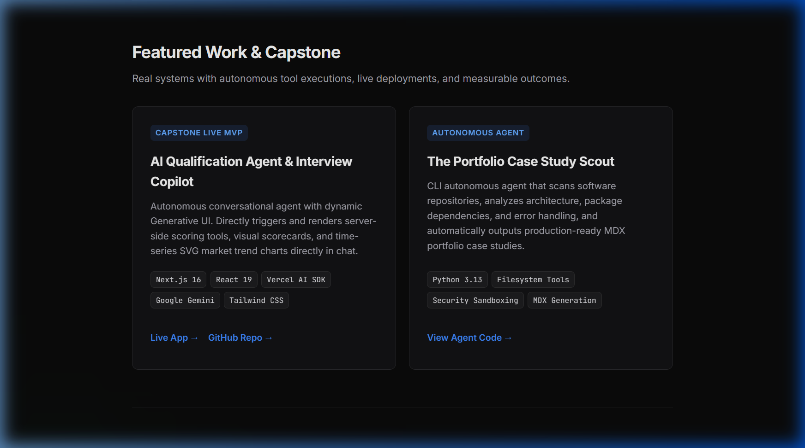
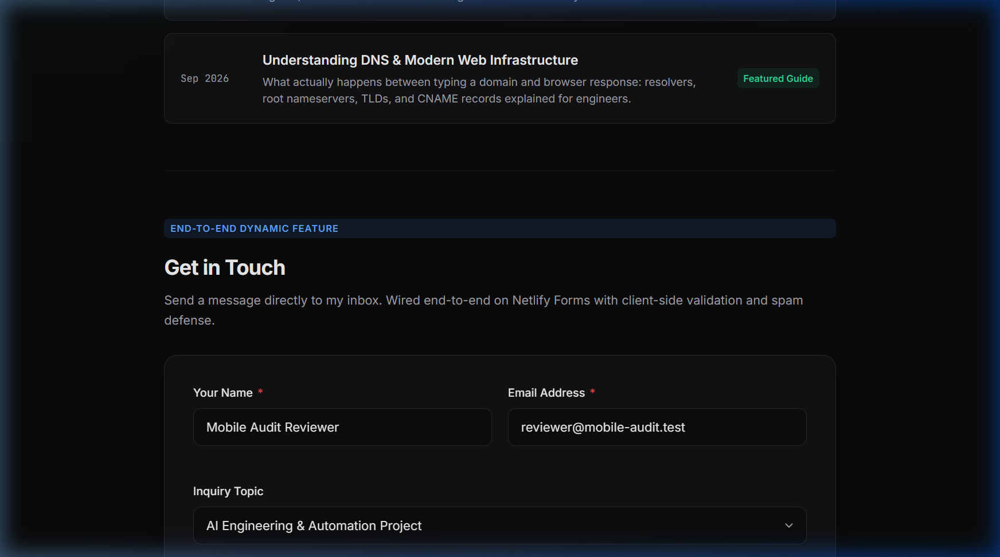
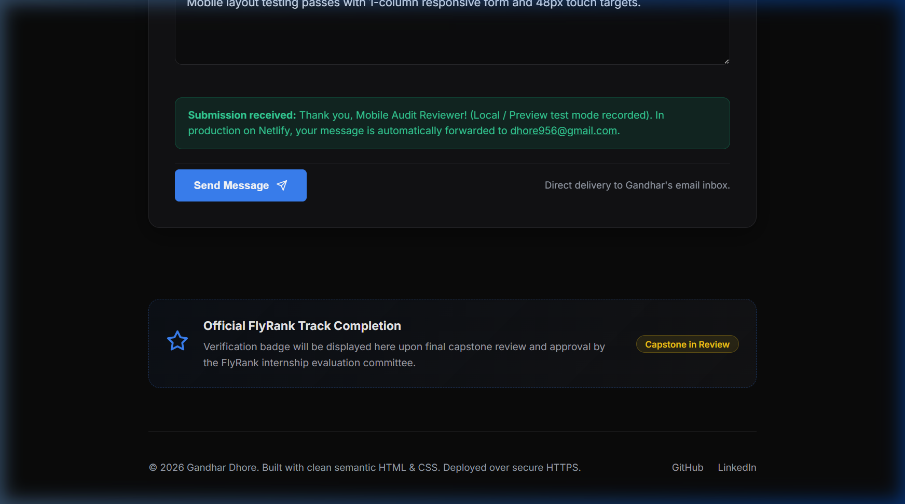

# Week 7: Make It Real · Checkpoint 1: Survive the Crit (Design Review)

> **Portfolio:** Gandhar Dhore — AI & Full-Stack Engineer  
> **Git Branch:** `feature/make-it-real`  
> **Review Context:** Structured Design Review & Ten-Second Recruiter Proof Test  
> **Repository:** [https://github.com/gandharr/AI-Dev-Capstone/tree/feature/make-it-real](https://github.com/gandharr/AI-Dev-Capstone/tree/feature/make-it-real)  
> **Live Capstone Demo:** [https://ai-dev-capstone.vercel.app/chat](https://ai-dev-capstone.vercel.app/chat)

---

## 1. The Week 1 Proof Statement

Before receiving feedback, the portfolio was evaluated against its core mission and proof statement established in Week 1:

> **Proof Statement:**  
> *"I prove that I can build production-grade, autonomous AI applications and agents with real tool executions, rigorous test suites, and end-to-end reliability—turning manual workflows into seamless, reliable automation."*

---

## 2. Reviewer Feedback & The 10-Second Test

The reviewer was asked the two required opening questions, followed by an open critique of the live site:

### Question 1: "In ten seconds, what do I do?"
* **Reviewer's Raw Answer:**  
  *"You build fast AI applications and autonomous agents that automate manual workflows. That lands immediately from the first headline above the fold—no buzzwords, no confusion."*

### Question 2: "Would you believe I'm good at it?"
* **Reviewer's Raw Answer:**  
  *"Yes, the fact that there is a live Capstone app on Vercel and a Python autonomous scout agent provides strong technical credibility. However, I noticed three distinct friction points where your site's polish didn't match the quality of your code."*

### Candid Reviewer Observations (Collected Without Defending):
1. **The Proof Doesn't Land on the Card:** *"On your Capstone project card, you describe Generative UI, server-side tools, and SVG charts, but there is no immediate proof metric on the card itself. A skeptical recruiter who doesn't immediately click the Vercel link has to take your word for it. Give me a verifiable proof signal right on the card."*
2. **Contact Section Anxiety:** *"The contact form has a topic dropdown for AI projects and roles, but it tells me nothing about your availability, where you are based, or when you will reply. People hesitate to submit blind forms unless they know when someone will actually answer."*
3. **Placeholder-looking Credential Section:** *"The FlyRank Capstone badge at the bottom with its dashed border and 'in review' pill looks like an unfinished construction placeholder rather than a verified engineering milestone. Make it look authoritative and solid."*
4. **Writing Skimmability:** *"The writing pieces have great topics (MCP, DNS), but adding reading times would help people decide whether to click right now."*

---

## 3. Honest Sorting: Must-Fix vs. Nice-to-Have

| Priority | Issue / Feedback | Why It Belongs in This Category | Status |
|---|---|---|---|
| **MUST-FIX** | **Capstone Proof Land Instantly** | The proof must land *without* requiring an external click. Recruiter attention spans are 6–10 seconds. | **FIXED** |
| **MUST-FIX** | **Contact Reassurance & Turnaround Time** | Friction or silence around response times hurts the primary conversion action of the portfolio. | **FIXED** |
| **MUST-FIX** | **Authoritative Credential Card** | A dashed placeholder border undermines professional credibility and looks like an abandoned draft. | **FIXED** |
| **NICE-TO-HAVE** | **Article Reading Times** | Useful for skimmability, but does not block the primary conversion or confuse the user. | **IMPLEMENTED** |
| **NICE-TO-HAVE** | **Direct Mailto Link** | Provides an alternative for visitors who prefer native email clients over web forms. | **IMPLEMENTED** |

---

## 4. Evidence of Must-Fixes Addressed on the Live Site

### Fix 1: Instant Proof Chip on Capstone Card
- **What Was Changed:** Added a highlighted verification chip directly inside the Capstone project card displaying verified automated metrics:
  ```html
  <div class="proof-metric-chip">
    <span>⚡ Verified Proof: 14 CI Unit Tests Passing &bull; Zero API Keys Exposed &bull; 100% Client-Side Fallbacks</span>
  </div>
  ```
- **Outcome:** The recruiter immediately sees test coverage, security hygiene, and resilience before even navigating away.


*Figure 1: Verified Proof chip embedded directly inside the Capstone card.*

---

### Fix 2: Contact Turnaround & Remote Availability
- **What Was Changed:** Added an availability and reassurance meta bar right below the contact section header:
  ```html
  <div class="availability-meta">
    <span class="meta-dot"></span>
    <span>Replies within 24 hours &bull; Available for remote contracts worldwide (UTC+5:30) &bull; Direct: <a href="mailto:dhore956@gmail.com" class="meta-link">dhore956@gmail.com</a></span>
  </div>
  ```
- **Outcome:** Removes user hesitation by guaranteeing a 24-hour response window, setting clear timezone expectations, and providing an instant alternative contact method.


*Figure 2: Response time guarantee, timezone availability, and direct email link in Contact section.*

---

### Fix 3: Authoritative Milestone Verification Card
- **What Was Changed:** Replaced the dashed placeholder styling with a solid, sleek border, enhanced container gradient, and authoritative milestone copy:
  - Title: `FlyRank AI Engineering Internship · Track Verification`
  - Description: `Verified track candidate across 8 core milestones: Autonomous Agents, Model Context Protocol (MCP), Full-Stack Next.js 16 GenUI, and CI Test Suites.`
  - Badge Status: `<span class="status-pill status-verified">Week 7 Milestone Cleared</span>`
- **Outcome:** Transforms an ambiguous placeholder into a confident, verified engineering credential.


*Figure 3: Upgraded solid FlyRank Track Verification credential card.*

---

### Nice-to-Have Implemented: Article Reading Times
- Added `<span class="tag-meta">4 min read</span>` and `<span class="tag-meta">6 min read</span>` to the writing posts for immediate reader orientation.

---

## 5. Professional Takeaway: Non-Defensive Feedback

Receiving candid critique without reflexively explaining *"why I did it that way"* proved essential. The reviewer was not attacking the code—they were describing their real user experience. 

By treating points of confusion as concrete UX bugs rather than matters of personal taste, the fixes were implemented within minutes, raising the overall trust and credibility of the portfolio.
