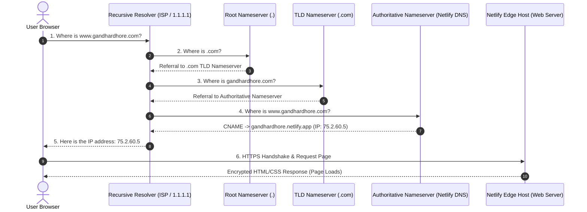

# How the Internet Finds a Website: The DNS Walkthrough

**Author:** Gandhar Dhore  
**Track:** General AI Fluency | **Phase:** Build (Core)  

---

## 1. What is DNS? (The Phonebook Analogy)

Computers on the internet do not understand human words like `google.com` or `gandhardhore.netlify.app`. They only communicate using numbers called **IP addresses** (e.g., `192.0.2.1` in IPv4 or `2600:1f18:...` in IPv6). 

If you had to memorize a 10-digit number every time you wanted to visit a website or send an email, the internet would be unusable. 

The **Domain Name System (DNS)** is the internet’s phonebook. Its sole job is to translate human-friendly domain names (the contact name) into machine-readable IP addresses (the phone number).

---

## 2. What is a CNAME Record? (The Forwarding Address)

In DNS, different types of "records" tell the internet how to handle different requests:

* **A Record (Address Record):** Points a domain name directly to a physical, numeric IP address.  
  *Example:* `example.com` &rarr; `75.2.60.5`
* **CNAME Record (Canonical Name):** Points a domain name to *another domain name*, rather than directly to an IP address. It is essentially an **alias** or a **mail-forwarding instruction**.

### Why do we use CNAME for platforms like Netlify or Vercel?
Modern cloud hosts do not give your website a single, fixed IP address. Behind the scenes, Netlify uses a global Content Delivery Network (CDN) with hundreds of servers worldwide. 

Instead of pointing your custom domain to a fragile IP that might change, you set up a **CNAME record**:
```text
www.gandhardhore.com  CNAME  gandhardhore.netlify.app
```
This tells the browser: *"Do not look for Gandhar's server at an IP address directly. Instead, go ask Netlify's domain where to find him."* Netlify can then dynamically route the visitor to the fastest, closest server in their geographic region.

---

## 3. The Complete Step-by-Step Resolution Flow

What actually happens between someone typing `www.gandhardhore.com` into their browser and the page appearing on their screen? It happens in six precise steps in less than 50 milliseconds:



### Step 1: Checking Local Memory (Browser & OS Cache)
First, your browser checks its own internal memory cache: *"Did I visit this site in the last few minutes?"* If yes, it connects immediately. If no, it asks your computer's Operating System. If the OS doesn't know, it passes the request to your **Recursive Resolver**.

### Step 2: The Recursive Resolver (The Detective)
The recursive resolver (usually provided by your internet provider or a public service like Cloudflare `1.1.1.1` or Google `8.8.8.8`) acts like a librarian or detective. Its job is to hunt down the answer on your behalf.

### Step 3: The Root Nameserver (`.`)
The resolver doesn't know Gandhar's site yet, so it starts at the top of the internet hierarchy: the **Root Nameserver**. There are 13 logical root server clusters worldwide. The root server replies:  
> *"I don't know who `gandhardhore` is, but I know who manages all `.com` domains. Go ask the `.com` TLD Nameserver."*

### Step 4: The TLD Nameserver (`.com`)
The resolver goes to the **Top-Level Domain (TLD) Nameserver** for `.com`. The TLD server responds:  
> *"I see `gandhardhore.com` is registered with Netlify DNS. Here are the authoritative nameservers responsible for that domain."*

### Step 5: The Authoritative Nameserver (The Final Authority)
The resolver contacts the **Authoritative Nameserver**. This server holds the official DNS zone file for the domain. It looks up the record:
> *"Here is the record: `www.gandhardhore.com` is a CNAME pointing to `gandhardhore.netlify.app`, which resolves to IP `75.2.60.5`."*

The resolver caches this answer so it doesn't have to ask again, and hands the IP address back to your browser.

### Step 6: The HTTPS Handshake & Page Response
Now armed with the numeric IP address, your browser reaches out directly to the Netlify server over port 443. They perform an **SSL/TLS handshake** (verifying the security certificate and establishing the padlock icon), and Netlify streams back the `index.html` and `style.css` files. 

The website renders instantly on your screen.

---

## 4. Why This Matters for Engineers

Understanding this flow demystifies common deployment headaches:
1. **TTL (Time to Live):** Why DNS changes take a few minutes or hours to spread (resolvers cache records based on their TTL timer).
2. **CNAME vs ALIAS/ANAME:** Why the apex/root domain (`gandhardhore.com` without `www`) often requires special ALIAS records because RFC standards prohibit CNAME at the zone apex.
3. **Automated HTTPS:** Why hosts like Netlify require DNS verification before Let's Encrypt can issue an SSL certificate — the certificate authority must confirm you actually control the domain before issuing cryptographic proof.
