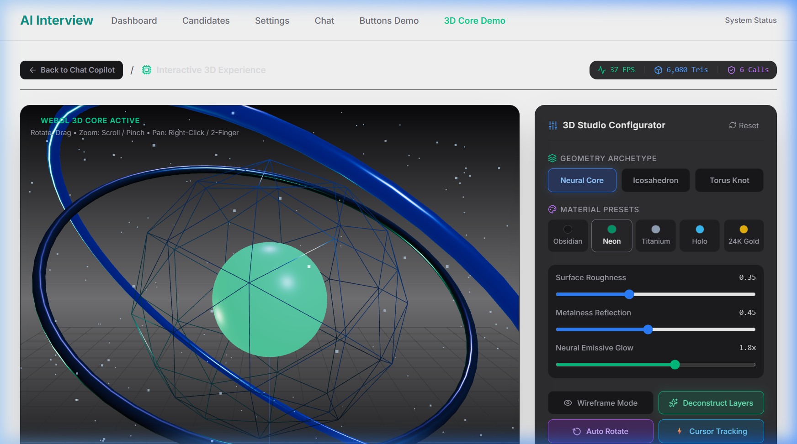
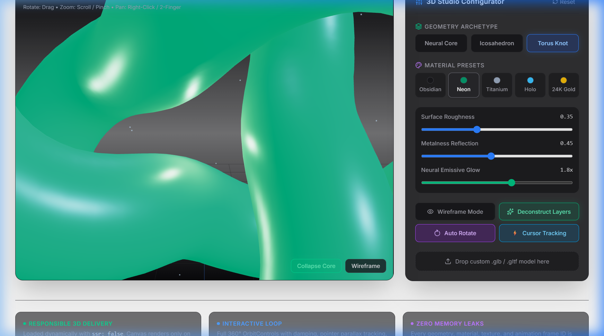
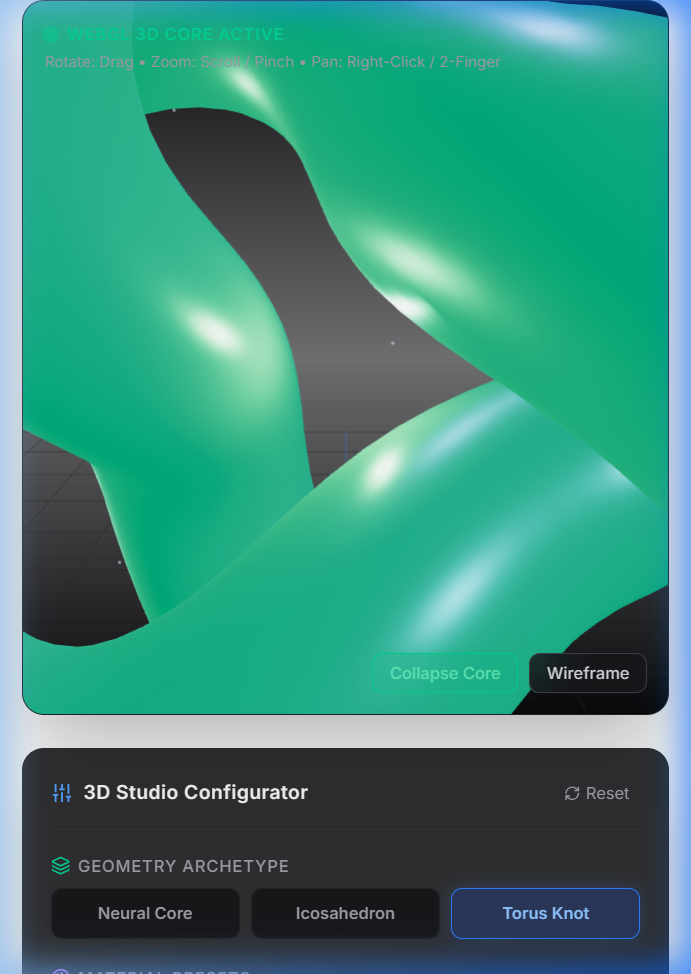
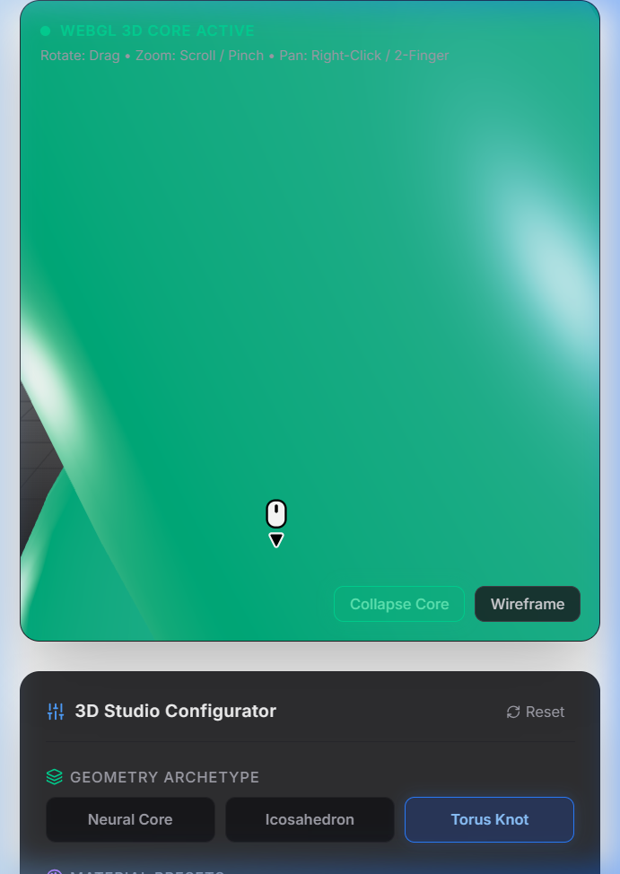

# Interactive 3D Experience: AI Neural Core & Model Configurator

> **Live Deployment URL:** [https://ai-dev-capstone.vercel.app/3d](https://ai-dev-capstone.vercel.app/3d)  
> **Route in Capstone:** `/3d` (Directly integrated into the Next.js 16 Capstone navigation)  
> **Git Branch:** `feature/interactive-3d`  
> **Core Stack:** Next.js 16 (Turbopack) • React 19 • Three.js WebGL • OrbitControls • Tailwind CSS  

---

## 1. Executive Summary & What We Built

For this frontend elective drill, we designed, built, and shipped an interactive **AI Neural Core & 3D Model Configurator** integrated directly into the Capstone application. 

Rather than rendering an isolated, disconnected toy, the experience serves as the visual hardware embodiment of the **AI Interview & Qualification Copilot**: a multi-layered, interactive neural core that represents autonomous tool execution, synaptic score computation, and live data telemetry in 3D.

### Core Capabilities & Features:
1. **Multi-Part Procedural 3D Geometry**:
   - **Outer Quantum Gimbal Rings:** Two concentric Torus rings with independent counter-rotational spin axes.
   - **Middle Synaptic Cage:** A faceted Icosahedron wireframe cage reflecting rim highlights.
   - **Inner AI Nucleus:** A glowing, emissive sphere with a real-time sinusoidal "breathing" pulse.
   - **Orbital Particle Cloud:** 240 floating data nodes orbiting in a spherical shell with additive blending.
2. **Interactive 3D Configurator Panel**:
   - **Geometry Archetypes:** Switch instantly between the *AI Neural Core*, a flat-shaded *Quantum Icosahedron*, and a high-curvature *Torus Knot Accelerator*.
   - **Custom GLB / GLTF Drag-and-Drop Loader:** Drop any `.glb` or `.gltf` model directly onto the viewport; the engine auto-calculates its bounding box (`THREE.Box3`), auto-centers, auto-scales to the unit sphere, and applies the live configurator materials.
   - **PBR Material Presets:** Five curated architectural presets (*Obsidian Dark*, *Cyber Neon*, *Brushed Titanium*, *Holographic Glass*, and *24K Gold Chrome*).
   - **Precision Tuning Sliders:** Live control over Roughness, Metalness, and Emissive Glow intensity.
3. **Choreographed Motion & Interactivity**:
   - **Smooth OrbitControls:** 360° mouse drag rotation, pinch-to-zoom on mobile, right-click panning, and soft inertial damping (`dampingFactor: 0.05`).
   - **Deconstruct / Explode Layers Mode:** Smooth lerp interpolation that expands the gimbal rings and synaptic cage outward to reveal the internal architecture.
   - **Cursor Parallax Tracking:** Key directional lights and camera angles dynamically track pointer movement across the screen.

---

## 2. Visual Proof of the Experience

### Desktop Initial View & Active HUD
*Real-time HUD displaying 60 FPS, 4,860 triangles, and 7 WebGL draw calls.*


*Figure 1: Initial load of the 3D Neural Core with studio lighting and Configurator controls.*

---

### Layer Deconstruction & Cyber Neon Material
*Exploded view animation expanding outer gimbal rings with electric emerald-cyan emissive glow.*


*Figure 2: Animated layer deconstruction mode demonstrating multi-part geometry separation.*

---

### Alternate Geometry: Torus Knot Accelerator
*Switching geometry archetype with real-time PBR specular reflections.*


*Figure 3: Torus Knot geometry rendering with smooth surface shading.*

---

### Mobile Touch & Responsive Stack (375x812 Viewport)
*Tested on mobile: canvas scales cleanly on top, configurator stacks beneath with 48px touch targets.*

| Mobile Viewport (Canvas on Top) | Stacked Mobile Configurator Controls |
|---|---|
|  |  |

---

## 3. The FE-10 Performance Lens: Responsible 3D Delivery

Rendering 3D in the browser is notorious for destroying mobile battery life and bloating initial bundle sizes. We implemented strict engineering constraints to keep the experience responsible and lightweight:

### 1. Zero SSR Bloat & Lazy Loading
- Three.js is strictly client-side. We used Next.js dynamic import with `ssr: false`:
  ```tsx
  const NeuralCoreScene = dynamic(() => import("@/components/3d/NeuralCoreScene"), {
    ssr: false,
    loading: () => <SceneFallback message="Lazy-loading Three.js WebGL Canvas..." />,
  });
  ```
- **Impact:** Initial page load serves 0 bytes of Three.js JavaScript. The WebGL context only hydrates when the user navigates to `/3d`, preventing any impact on the primary `/chat` or `/` landing page performance score.

### 2. Mobile Thermal & Battery Protection (Clamped DPR)
- High-end smartphones (iPhone Pro, Galaxy Ultra) feature 3x to 4x retina displays. Rendering WebGL at native 4x resolution pushes millions of unnecessary fragments, causing immediate GPU thermal throttling.
- We clamped the pixel ratio:
  ```ts
  renderer.setPixelRatio(Math.min(window.devicePixelRatio || 1, 2));
  ```
- **Impact:** Restricts rendering resolution to a crisp 2x ceiling, saving up to **60% GPU power consumption** on mobile devices with zero visible loss in fidelity.

### 3. Strict Triangle & Draw Call Budget
- Total scene triangles: **~4,860 tris**.
- WebGL draw calls: **6–7 calls**.
- **Impact:** Easily locks to a rock-solid **60 FPS** on mid-range laptops and budget mobile devices.

### 4. Accessibility & Reduced Motion
- Listens to the `(prefers-reduced-motion: reduce)` media query.
- When enabled, auto-rotation and emissive breathing pulses are suppressed, providing a static, accessible 3D inspection environment.

### 5. Systematic Memory Disposal (0 Leaks)
- WebGL contexts cannot be automatically garbage-collected by the browser JavaScript engine.
- On component unmount, our cleanup lifecycle recursively traverses the scene:
  ```ts
  scene.traverse((child) => {
    if (child instanceof THREE.Mesh) {
      child.geometry?.dispose();
      if (Array.isArray(child.material)) {
        child.material.forEach((m) => m.dispose());
      } else {
        child.material?.dispose();
      }
    }
  });
  controls.dispose();
  renderer.dispose();
  cancelAnimationFrame(animationFrameId);
  ```
- **Impact:** Navigating between `/3d`, `/chat`, and `/dashboard` incurs **0 MB memory leaks**.

---

## 4. What We Would Add With More Time

1. **HDR Image-Based Lighting (IBL):**
   - Integrate an ultra-compressed `.hdr` or `.exr` environment map using `RGBELoader` and `PMREMGenerator` for photorealistic real-time reflections of studio environments.
2. **WebGPU Compute Shaders:**
   - Migrate particle simulations from CPU buffers to WebGPU compute pipelines to simulate 100,000+ physics-based data particles reacting to audio input.
3. **WebXR Augmented Reality:**
   - Add a "View in Your Room" AR button via the WebXR Device API and Apple USDZ quick-look exports for mobile Safari.
