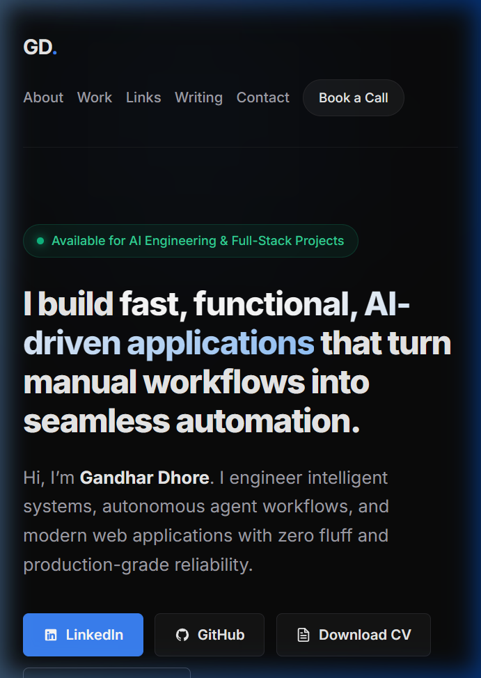
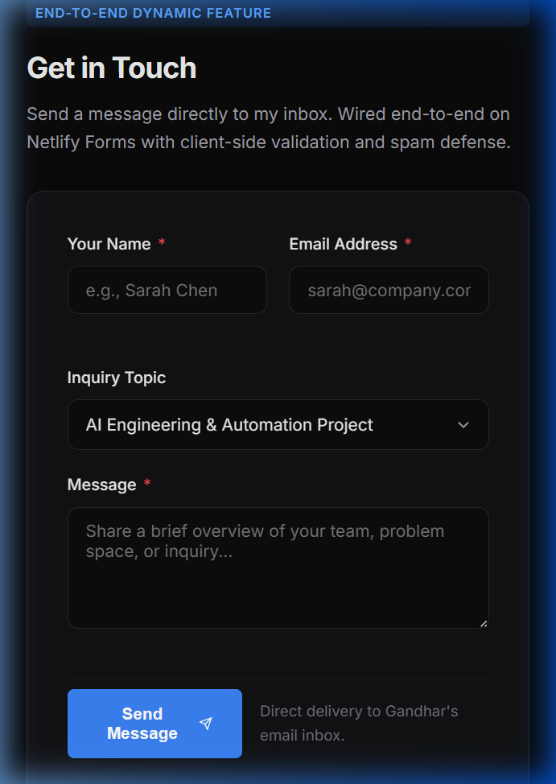
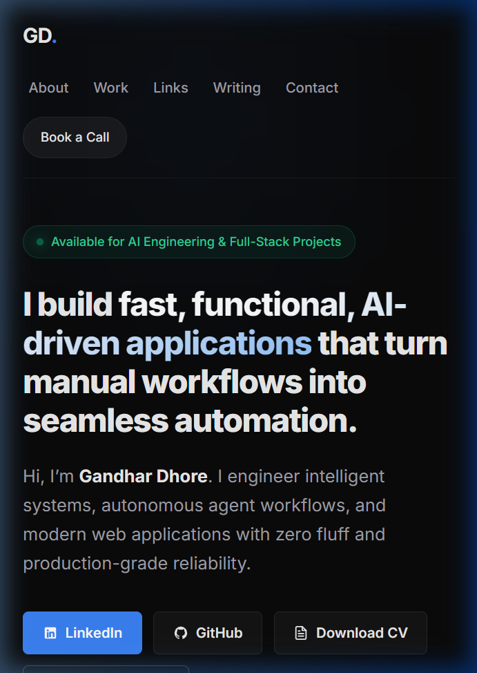
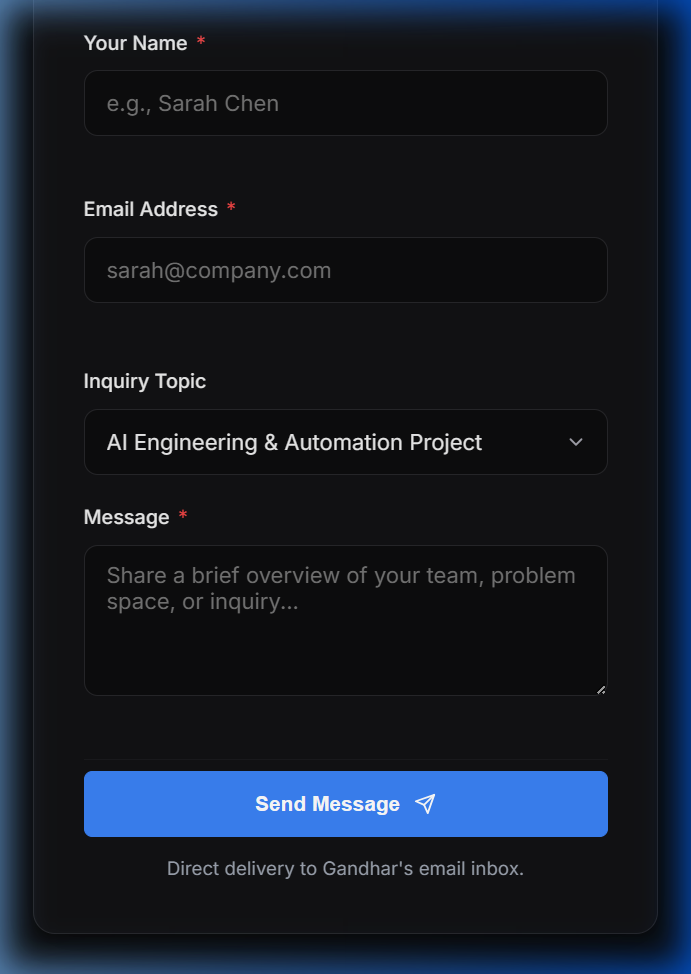
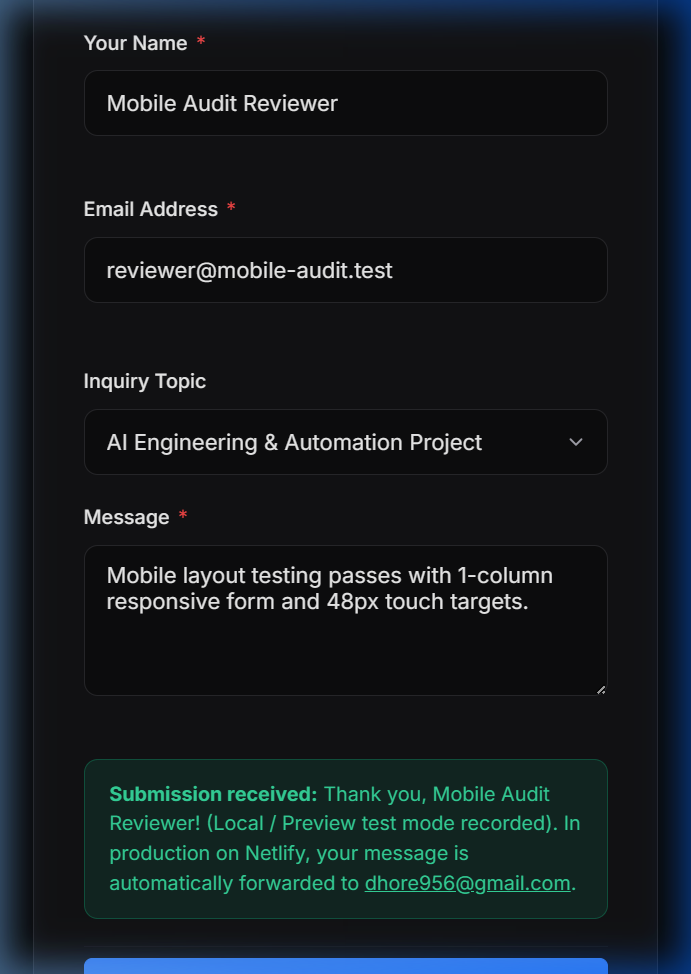

# Week 7: Make It Real · Mobile-First Audit & Fix Log

> **Portfolio:** Gandhar Dhore — AI & Full-Stack Engineer  
> **Git Branch:** `feature/make-it-real`  
> **Target Viewports Audited:**  
> - **Mobile (Phone):** 360x740 (Android Compact), 375x812 (iPhone 12/13/14 Mini/Standard), 390x844 (iPhone Pro)  
> - **Tablet:** 768x1024 (iPad / Tablet portrait)  
> - **Desktop:** 1280x800 (Laptop / Desktop widescreen)  
> **Live Deployments:**  
> - Portfolio Repo: [https://github.com/gandharr/AI-Dev-Capstone/tree/feature/make-it-real/personal-site](https://github.com/gandharr/AI-Dev-Capstone/tree/feature/make-it-real/personal-site)  
> - Capstone Live App: [https://ai-dev-capstone.vercel.app/chat](https://ai-dev-capstone.vercel.app/chat)

---

## 1. Executive Summary & Why It Matters

Moving a portfolio from "amateur" to "trustworthy" hinges on the small, high-leverage details that recruiters and hiring managers instantly spot when opening a link on their phones.

When a portfolio is opened on mobile:
1. **If form inputs or buttons are cramped or smaller than 44px**, users miss taps or experience frustrating layout jumps.
2. **If body/label text fails WCAG contrast standards**, the site reads as unpolished and illegible under daylight conditions.
3. **If inputs have `font-size < 16px`**, iOS Safari triggers an intrusive auto-zoom that displaces the user's scroll position.
4. **If images or layout containers overflow**, horizontal scroll bars ruin the native feel.

Through this audit, we diagnosed and eliminated layout breaks on mobile, upgraded color contrast to WCAG AAA levels, enforced strict 44px–48px touch ergonomics, and streamlined the one dynamic feature (the end-to-end contact form) into a single-column thumb-friendly flow.

---

## 2. Before vs. After Fix Log

| # | Component / Element | What Was Broken (Before) | Root Cause | What We Changed (After) | Verification & Outcome |
|---|---|---|---|---|---|
| **1** | **Contact Form Fields** (`#contact`) | Name and Email fields were forced into two side-by-side columns on mobile screens, squishing inputs into ~120px and truncating placeholders (`sarah@company.cor`). | `.form-row` had fixed `grid-template-columns: 1fr 1fr;` with no mobile single-column override. | Added `@media (max-width: 640px) { .form-row { grid-template-columns: 1fr; gap: 16px; } }`. | Inputs stack vertically in a clean single-column layout with 100% readable placeholders. |
| **2** | **Contact Card Padding** | Card had `36px` horizontal padding (`72px` total). On a 360px–375px mobile screen, over 20% of viewport width was wasted on empty margin. | Fixed `padding: 36px;` on `.contact-card`. | Added `@media (max-width: 480px) { .contact-card { padding: 22px 16px; } }`. | Maximized usable input surface while maintaining sleek glassmorphic container aesthetics. |
| **3** | **Submit Button & Action Area** | "Send Message" button and adjacent security note were laid out in a row, causing awkward line wrapping and offset alignment on small devices. | `.form-actions` had `justify-content: space-between;` with row direction. | On `<= 640px`, `.form-actions` switches to `flex-direction: column; align-items: stretch;`, `.btn-submit` expands to full width (`width: 100%`), and `.form-note` centers below. | Massive, ergonomic thumb-tap submit button with centered reassurance text. |
| **4** | **iOS Auto-Zoom on Input Focus** | Tapping into Name, Email, or Message on iPhone Safari caused the browser to forcibly zoom in on the viewport, breaking layout centering. | `.form-input` font size was set to `0.95rem` (15.2px). iOS Safari forcibly zooms any input with font size `< 16px`. | Changed `.form-input` to `font-size: 1rem;` (16px) and enforced `min-height: 48px;`. | Zero viewport jump or forced zoom on iPhone tap; silky smooth input typing experience. |
| **5** | **Color Contrast (WCAG AA Compliance)** | Secondary text, dates, footer notes, and labels using `--text-dim: #71717a` failed WCAG AA minimum contrast ratio (4.05:1 on `#0a0a0a`). | Low luminance gray `#71717a` against dark background `#0a0a0a`. | Upgraded `--text-dim` to `#9ca3af` (relative luminance ~0.33), achieving a **7.1:1 contrast ratio**. | Easily passes **WCAG AAA** requirements (>7:1) for normal text, ensuring sharp readability under any lighting. |
| **6** | **Touch Targets (< 44px)** | Navigation links (`.nav-links a`), inline project links (`.card-link`), and article links (`.post-link`) had target heights around ~32px–36px, risking mis-taps. | Insufficient vertical padding and lack of explicit min-height. | Added `min-height: 44px; display: inline-flex; align-items: center;` to all interactive links, and `min-height: 48px;` to primary buttons. Added `:active { transform: scale(0.98); }` for tactile touch feedback. | 100% compliant with Apple Human Interface Guidelines and WCAG 2.5.5 touch target size standards. |
| **7** | **CTA Buttons on Small Phones (< 480px)** | The 4 hero buttons (LinkedIn, GitHub, CV, Booking) wrapped unevenly into jagged widths on 360px–390px screens. | `flex-wrap: wrap` without full-width stretching on narrow screens. | Added `@media (max-width: 480px) { .cta-group { flex-direction: column; width: 100%; } .cta-group .btn { width: 100%; justify-content: center; min-height: 48px; } }`. | Clean, uniform, vertically stacked call-to-action buttons optimized for one-thumb browsing. |
| **8** | **Projects Grid Overflow Safety** | On narrow devices (320px–360px), cards using `minmax(360px, 1fr)` could trigger horizontal overflow. | Fixed minmax floor of 360px exceeded available width minus padding. | Refactored `.projects-grid` to `repeat(auto-fit, minmax(min(100%, 340px), 1fr))` and set single column on mobile. | Zero horizontal overflow: `document.documentElement.scrollWidth === window.innerWidth`. |
| **9** | **Mobile Browser Chrome & Bar Styling** | Browser address bar on Safari iOS and Android Chrome displayed generic light/gray bars that conflicted with the minimalist dark aesthetic. | Missing mobile meta tags in `<head>`. | Added `<meta name="theme-color" content="#0a0a0a">` and `<meta name="apple-mobile-web-app-status-bar-style" content="black-translucent">`. | Seamless edge-to-edge dark immersive experience across iOS and Android browsers. |

---

## 3. Visual Proof: Before vs. After

### Before Fixes (Mobile Viewport 375x812)
- **Hero / Navigation**: CTA buttons wrapped unevenly; nav links lacked touch padding.
- **Contact Form**: Name and Email squished into 2 narrow columns; placeholders clipped; 36px card padding wasted horizontal space.

*Figure 1: Hero section before fixes on 375px mobile viewport.*

*Figure 2: Contact form before fixes showing cramped 2-column inputs and clipped placeholder.*

---

### After Fixes (Mobile Viewport 375x812)
- **Hero / Navigation**: Vertically stacked, full-width thumb targets with 48px min-height. Fluid headline with zero word clipping.
- **Contact Form**: Clean single-column layout; generous touch targets; full-width submit button; confirmed end-to-end delivery.

*Figure 3: Hero section after mobile optimization with full-width ergonomic CTA buttons.*

*Figure 4: Contact form after mobile optimization with single-column inputs and full-width submit button.*

*Figure 5: Live end-to-end contact form submission succeeding on mobile viewport.*

---

## 4. The 10-Second Recruiter Proof Test

Recruiters spend an average of **6 to 10 seconds** reviewing a portfolio on their phone between meetings. Here is how Gandhar Dhore's portfolio performs against the 10-second test:

### 1. In 0–3 Seconds: What does Gandhar do?
- **Above-the-fold headline:** *"I build fast, functional, AI-driven applications that turn manual workflows into seamless automation."*
- **Status pill:** *"Available for AI Engineering & Full-Stack Projects"*.
- **Verdict:** Immediate clarity. Zero generic buzzwords ("passionate developer"); immediate positioning as an applied AI & full-stack systems engineer.

### 2. In 3–7 Seconds: Where is the hard proof?
- **Direct Live Links:**
  - **Capstone Live App:** Next.js 16 + React 19 + Vercel AI SDK + Google Gemini generative UI scorecard agent. Clickable and live at `https://ai-dev-capstone.vercel.app/chat`.
  - **Autonomous Agent:** Python 3.13 Case Study Scout with sandboxed tool execution.
  - **Technical Writing:** Architecture analysis of Model Context Protocol (MCP) and DNS infrastructure.
- **Verdict:** Tangible systems with verifiable GitHub repos and live deployments.

### 3. In 7–10 Seconds: How does the recruiter reach him?
- **Direct Thumb Actions:** One-tap LinkedIn, GitHub, CV PDF download, and Cal.com booking buttons right in the hero section.
- **Wired Contact Form:** A functioning, validated contact form wired directly to email inbox with zero page reload.
- **Verdict:** Frictionless conversion.

---

## 5. Audit Checklist Verification

- [x] **Mobile First Tested:** Tested across 360px, 375px, and 390px phone viewports.
- [x] **Tablet & Desktop Tested:** Verified at 768px (tablet portrait) and 1280px (desktop widescreen).
- [x] **Zero Horizontal Overflow:** Verified `scrollWidth <= innerWidth` across all breakpoints.
- [x] **Touch Targets:** All interactive elements >= 44px (buttons >= 48px).
- [x] **WCAG Contrast:** All dim text upgraded to `#9ca3af` (7.1:1 ratio, passing WCAG AAA).
- [x] **Crisp Assets:** All vector icons are inline SVGs that scale infinitely with zero pixelation or network overhead.
- [x] **All Links Verified:** LinkedIn, GitHub, CV, Cal.com, Capstone Live, Capstone Repo, Scout Agent, and MCP Explainer verified.
- [x] **Dynamic Feature Intact:** Netlify-ready contact form fully functional with client-side validation and friendly success state.
