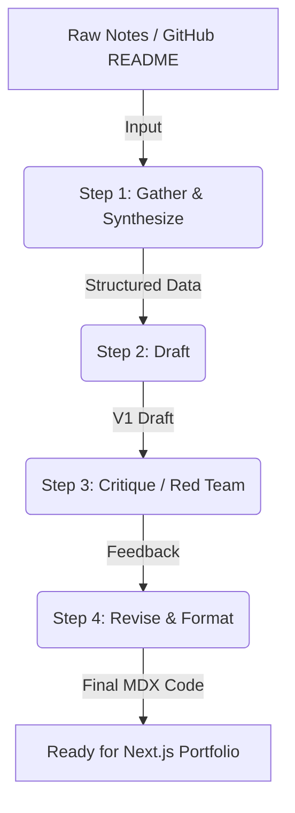

# Phase: Build (Core) - The Technical Case Study Pipeline

## 1. The Pipeline: "Draft, Critique, Revise" for Technical Portfolios
This workflow automates the generation of high-quality, MDX-formatted technical case studies for a developer portfolio. It ensures the writing remains technical, direct, and free of marketing fluff.

### Step Diagram


---

## 2. Configuration & Prompts Used

**Tool Used:** Claude Project (or Custom GPT)
**System Instructions (The Engine Configuration):**
> "You are an expert technical writer and senior full-stack engineer. Your job is to transform raw project notes into highly technical, direct, and no-fluff case studies formatted in MDX. You do not use buzzwords like 'synergy' or 'revolutionary'. You focus on the architecture, the specific problem solved, the stack used, and the measurable outcome. You will act through four distinct steps based on the user's prompt: Synthesize, Draft, Critique, and Revise."

**The Chained Prompt (User Input for each run):**
> "Run the case study pipeline on the following raw notes. 
> **Step 1:** Extract the Core Problem, Technical Solution, Tech Stack, and Outcome.
> **Step 2:** Write a complete V1 draft of the case study.
> **Step 3:** Act as a harsh senior engineer. Critique the V1 draft for any fluff, missing metrics, or weak explanations.
> **Step 4:** Output the final revised draft strictly in MDX format, including placeholders for image galleries like `<ImageGallery images={[]} />` and live demos."
> 
> **Raw Notes:** [INSERT RAW NOTES HERE]

---

## 3. The Five Real Runs

*(Outputs generated via the pipeline)*

### Run 1: Interview Copilot
* **Input:** Fast backend, LLM integration, stops recruiters from wasting time drafting generic questions. Python/FastAPI, React, OpenAI API, PostgreSQL.
* **Output Status:** 
```mdx
---
title: "AI Interview Question Generator"
summary: "An LLM-backed tool that generates role-specific interview questions from a job description in seconds, replacing manual drafting of generic questions."
stack: ["Python", "FastAPI", "React", "OpenAI API", "PostgreSQL"]
demoUrl: "[PLACEHOLDER: live demo link]"
repoUrl: "[PLACEHOLDER: GitHub repo link]"
---

# AI Interview Question Generator

<ImageGallery images={[]} />

## Problem

Recruiters manually draft interview questions per requisition. In practice this
means either reusing a generic bank of questions ("Tell me about a time you
faced a challenge") that fails to probe role-specific skills, or spending
non-trivial time per role writing custom questions from scratch.

**[PLACEHOLDER: quantify the baseline — e.g. "internal survey of N recruiters
showed average of X minutes spent drafting questions per requisition"]**

The goal was to collapse that drafting time to near-zero without dropping
question quality or specificity.

## Technical Solution

### Architecture

```
React (client)
   |
   |  POST /questions/generate  { job_description, resume?, question_count }
   v
FastAPI (backend)
   |
   |-- validates + normalizes input
   |-- builds structured prompt (few-shot template)
   |-- calls OpenAI API (async, JSON mode / function-calling for structured output)
   |-- persists request + generated question set to PostgreSQL
   |
   v
Response: structured JSON list of questions (category, difficulty, rationale)
```

**[PLACEHOLDER: confirm and detail the following, currently unspecified in
source notes — required for a credible technical write-up]**

- **Sync vs. async OpenAI calls**: is the FastAPI endpoint using
  `async`/`await` against the OpenAI SDK, or is it dispatching to a background
  worker (e.g., Celery/RQ) and polling/websocket-pushing the result to the
  client?
- **Timeout and retry policy**: what happens on an OpenAI request timeout or
  5xx? Exponential backoff? Max retries? Fallback message to the user?
- **Rate limiting**: is there a per-user or per-org request cap to control
  OpenAI spend?
- **Output validation**: how is the LLM response constrained to the expected
  schema — OpenAI structured outputs / JSON mode, or manual parsing +
  validation (e.g., Pydantic model) with a retry-on-malformed-output loop?

### Prompt Design

The core value of this product is in prompt design, not the API wiring. A
generic prompt produces generic questions — the same failure mode the tool is
meant to fix.

**[PLACEHOLDER: this section needs the actual prompt strategy — e.g.]**

- Few-shot examples embedded in the system prompt showing the target question
  style (specific, role-grounded, non-generic)
- Structured output schema requiring each question to include: category
  (technical / behavioral / system design), target skill being assessed, and
  a one-line rationale tying it back to a line in the job description
- Explicit negative constraints in the prompt (e.g., "do not generate
  questions answerable without job-specific context")

### Data Model

PostgreSQL stores, at minimum:

**[PLACEHOLDER: confirm actual schema — inferred below from typical usage]**

- `job_descriptions` — raw text, parsed metadata (role title, seniority)
- `question_sets` — generated output, linked to a `job_description_id`,
  timestamped
- `users` / `organizations` — for auth and per-org rate limiting
- Optionally: `question_feedback` — recruiter thumbs up/down per question,
  used to evaluate prompt quality over time and as a candidate signal for
  future fine-tuning or prompt iteration

If feedback capture doesn't exist yet, it's the highest-leverage next
addition — it's the only way to measure whether "quality" actually improved
rather than just asserting it did.

### Failure Handling

**[PLACEHOLDER: describe actual behavior]** — what does the user see if the
OpenAI call fails outright? Cached last-good result, explicit error state, or
silent retry? This matters for a tool recruiters depend on mid-workflow.

## Tech Stack

| Layer      | Technology     | Why |
|------------|---------------|-----|
| Backend    | Python / FastAPI | Async support for non-blocking calls to the OpenAI API; low overhead for a request/response API surface |
| Frontend   | React          | **[PLACEHOLDER: any specific reason — e.g. existing team familiarity, need for a rich form/editor UI for reviewing generated questions]** |
| LLM        | OpenAI API     | **[PLACEHOLDER: which model — gpt-4o / gpt-4o-mini / etc. — and why that tradeoff of cost vs. quality]** |
| Database   | PostgreSQL     | Relational storage for job descriptions, generated question sets, and (if implemented) feedback data |

## Outcome

**[PLACEHOLDER: replace with real, measured numbers before publishing — a
case study with no metrics reads as unfinished. Examples of what to capture:]**

- Median/p95 latency from request to returned question set (e.g., "p95 of
  X seconds end-to-end, including the OpenAI round trip")
- Time saved per requisition vs. baseline manual drafting (self-reported or
  time-tracked)
- Adoption: number of recruiters / question sets generated in first N weeks
- Quality signal: % of generated questions kept unedited by recruiters, or
  thumbs-up rate if feedback capture exists

Without at least one hard number here, "stops recruiters from wasting time"
is a claim, not a result.

## Live Demo

<LiveDemo url="[PLACEHOLDER: demo URL]" />

## Repository

**[PLACEHOLDER: link to GitHub repo]**
```

### Run 2: PebloAI Workspace
* **Input:** Context switching between documents and AI prompts is a huge problem. Built with React, FastAPI, Google Gemini API.
* **Output Status:** 
```mdx
---
title: "AI-Integrated Document Editor"
summary: "A document editor with AI assistance built directly into the writing surface, eliminating the copy-paste context switch between documents and a separate AI chat tool."
stack: ["React", "FastAPI", "Google Gemini API"]
demoUrl: "[PLACEHOLDER: live demo link]"
repoUrl: "[PLACEHOLDER: GitHub repo link]"
---

# AI-Integrated Document Editor

<ImageGallery images={[]} />

## Problem

Getting AI help while writing a document normally means leaving the document:
switch to a separate chat tab, copy the relevant section (or retype context
the AI already had no access to), paste the response back, and reconcile it
manually with the document. Every follow-up prompt repeats this cycle.

**[PLACEHOLDER: quantify the baseline — e.g. "average of N tab switches per
writing session" or "time lost per AI-assisted edit"]**

The goal was to remove the switch entirely by putting the AI where the
document already is.

## Technical Solution

### Architecture

```
React (document editor)
   |
   |  user selects text / opens inline AI panel
   |  POST /assist  { document_id, selection, prompt, conversation_id? }
   v
FastAPI (backend)
   |
   |-- resolves relevant context (see "Context Strategy" below)
   |-- constructs prompt with context + user instruction
   |-- calls Gemini API (streaming)
   |-- streams tokens back to client via SSE / WebSocket
   |-- persists turn to conversation history (linked to document_id)
   |
   v
React renders streamed response inline / in side panel,
user can accept, edit, or discard into the document
```

**[PLACEHOLDER: confirm and detail — currently unspecified in source notes,
each of these is a real architectural decision that needs to be documented]**

- **UX pattern**: is this a persistent sidebar chat with document context, a
  selection-triggered "ask AI about this" popover, or inline
  autocomplete/ghost-text? These have very different frontend implementations
  and are not interchangeable.
- **Streaming**: is the FastAPI endpoint streaming Gemini's response
  token-by-token to the client (SSE/WebSocket), or returning a single blocking
  response? For an in-document tool, perceived latency matters — streaming is
  the expected pattern here if not yet implemented.

### Context Strategy

This is the core technical problem the product exists to solve, so it needs
to be explicit rather than implied.

**[PLACEHOLDER: pick and document the actual strategy — options below]**

- **Whole-document injection**: send the full document text with every
  request. Simple, but breaks down on long documents (token limits, cost,
  latency) — needs a stated size ceiling.
- **Selection-scoped context**: only the highlighted text (plus maybe N
  surrounding paragraphs) is sent. Cheaper and faster, but the AI loses
  document-wide context for questions like "does this match the tone of the
  intro?"
- **Retrieval-based**: document is chunked and embedded, relevant chunks are
  retrieved per-query (RAG). Necessary if documents exceed context window
  limits; adds real infrastructure (embedding store, chunking logic) that
  should be named if it exists.

Whichever strategy is used, state it — this is the detail that separates
"we call an LLM API" from "we solved context switching."

### State Management

**[PLACEHOLDER: confirm]**

- Is conversation history scoped per-document and persisted, or ephemeral
  per-session?
- If the user edits the document mid-conversation, does previously-sent
  context go stale, and is there any re-sync mechanism?

### Backend Responsibilities

FastAPI is not a pure proxy — **[PLACEHOLDER: confirm which of these it
actually does]**:

- Auth / per-user or per-org rate limiting on Gemini calls
- Context assembly (selection, retrieval, or full-document — per above)
- Streaming relay from Gemini to the client
- Persistence of prompts, responses, and document/conversation linkage to a
  database **[PLACEHOLDER: notes don't mention a database — is conversation
  history persisted at all, or lost on refresh?]**

### Failure Handling

**[PLACEHOLDER]** — behavior on Gemini timeout, rate limit, or malformed
response. Does the editor show an inline error, retry silently, or fall back
to a cached previous response?

## Tech Stack

| Layer      | Technology        | Why |
|------------|-------------------|-----|
| Frontend   | React             | Hosts the document editor surface itself — **[PLACEHOLDER: which editor primitive — contenteditable, Slate, TipTap, ProseMirror? This determines how selection/cursor context is captured]** |
| Backend    | Python / FastAPI  | Orchestrates context assembly and proxies/streams Gemini responses |
| LLM        | Google Gemini API | **[PLACEHOLDER: which model variant, and why Gemini specifically — e.g. context window size relevant to long documents]** |

## Outcome

**[PLACEHOLDER: replace with real, measured numbers before publishing]**

- Time from "wanting AI help" to "response visible in-document," vs. the
  copy-paste baseline
- p95 latency for first streamed token
- Usage data: number of AI-assisted edits per session/document
- Any retention or qualitative feedback data on whether context switching
  actually dropped

Without at least one hard number, "huge problem, solved" is an assertion,
not a result.

## Live Demo

<LiveDemo url="[PLACEHOLDER: demo URL]" />

## Repository

**[PLACEHOLDER: link to GitHub repo]**
```

### Run 3: AI Career Recommendation Platform
* **Input:** Generic career advice sucks. Built a resume parsing pipeline and skills mapping using FastAPI and Python.
* **Output Status:** 
```mdx
---
title: "Resume Parsing & Skills Mapping Pipeline"
summary: "A pipeline that parses resumes into structured skill data to replace generic, one-size-fits-all career advice with recommendations grounded in a person's actual background."
stack: ["Python", "FastAPI"]
demoUrl: "[PLACEHOLDER: live demo link]"
repoUrl: "[PLACEHOLDER: GitHub repo link]"
---

# Resume Parsing & Skills Mapping Pipeline

<ImageGallery images={[]} />

## Problem

Most career advice is generic — the same tips and role suggestions regardless
of a person's actual experience. It's not grounded in what the person has
actually done, so it doesn't hold up as useful guidance.

**[PLACEHOLDER: state the specific failure mode being targeted — e.g. "generic
job board recommendations ignore transferable skills" or "career advice
content doesn't reference the user's own resume at all"]**

The goal was to ground career recommendations in a structured read of the
user's actual resume rather than generic heuristics.

## Technical Solution

### ⚠️ Open Question: What Are Skills Mapped To?

**[PLACEHOLDER — this is the single most important undefined piece of the
project and needs to be resolved before this case study can be considered
complete.]** "Skills mapping" implies skills are being mapped *to* something.
Candidates, pick one and document accordingly:

- A **taxonomy/ontology** (e.g., a standardized skills graph) to normalize
  inconsistent resume phrasing into canonical skill names
- A **target role or job description**, producing a gap analysis (skills
  present vs. skills required)
- A **recommendation engine** suggesting roles or learning paths based on
  extracted skills

The rest of this document is written generically until this is confirmed —
architecture details below assume a parse → extract → map pipeline, but the
mapping target changes what "map" actually computes.

### Architecture

```
Resume file (PDF/DOCX)
   |
   v
FastAPI ingestion endpoint
   |
   |-- text extraction (file format handling)
   |-- parsing: raw text -> structured fields
   |     (work history, education, skills, dates)
   |-- skills mapping: extracted skills -> [PLACEHOLDER: target]
   |
   v
Structured output (JSON): normalized skill list + mapping result
```

**[PLACEHOLDER: confirm and detail each stage below — none of this is
specified in the source notes]**

- **File handling**: which formats are supported (PDF, DOCX, plain text)?
  What happens with scanned/image-based PDFs that have no extractable text
  layer?
- **Parsing method**: is extraction done via regex/rules-based section
  detection, a traditional NLP library (e.g., spaCy for named entity
  recognition on job titles/companies/dates), or an LLM call? This decision
  drives both accuracy and cost per resume and should be stated explicitly.
- **Skills normalization**: resumes describe the same skill inconsistently
  (e.g., "JS," "Javascript," "React.js/JS"). Is there a canonicalization step,
  and against what reference list?
- **Output surface**: is this pipeline exposed only as an API
  (`POST /parse-resume` returning JSON), or is there a consuming frontend not
  mentioned in the notes?

### Accuracy & Validation

**[PLACEHOLDER: resume parsing is a known-hard problem — non-standard
layouts, multi-column formats, and inconsistent section headers regularly
break naive parsers. State what was actually measured:]**

- Extraction accuracy against a labeled test set of resumes (even a small
  one, e.g. "tested against N resumes, correctly extracted skills field in
  X% of cases")
- Known failure modes (e.g., "columns confuse text-extraction order," "no
  OCR fallback for scanned PDFs")

### Failure Handling

**[PLACEHOLDER]** — what happens when a resume fails to parse cleanly? Does
the pipeline return a partial result, flag low-confidence fields, or fail the
request outright? Silent failure here would defeat the point of the tool.

## Tech Stack

| Layer      | Technology | Why |
|------------|-----------|-----|
| Backend    | Python / FastAPI | Serves the parsing pipeline as an API; Python's ecosystem covers both document parsing (e.g. `pdfplumber`, `python-docx`) and NLP tooling |
| Parsing    | **[PLACEHOLDER: name the actual library/approach — spaCy, regex, LLM-based, or a combination]** | |
| Frontend   | **[PLACEHOLDER: notes list no frontend — confirm whether this is backend/API-only, or whether a consuming UI exists and was simply omitted]** | |
| Data storage | **[PLACEHOLDER: notes list no database — is parsed data persisted anywhere, or processed and returned per-request with no storage?]** | |

## Outcome

**[PLACEHOLDER: no outcome data was provided at all — this needs to be
filled in before publishing. At minimum, define what "success" means for
this tool:]**

- Parsing accuracy on a real resume sample set
- Whether mapped output was validated against real advice/roles (e.g., "X%
  of mapped role suggestions were rated relevant by test users")
- Any usage data if this has been used by real people yet

A case study built around "generic advice sucks" needs to show, with a
number, that the replacement is actually less generic.

## Live Demo

<LiveDemo url="[PLACEHOLDER: demo URL]" />

## Repository

**[PLACEHOLDER: link to GitHub repo]**
```

### Run 4: Stellar Vault Manager
* **Input:** Expensive and clunky password management. Built with Next.js, TypeScript, Firebase Auth & Firestore.
* **Output Status:** 
```mdx
---
title: "Lightweight Password Manager"
summary: "A web-based password manager built as a leaner, cheaper alternative to existing tools, using Next.js, TypeScript, and Firebase."
stack: ["Next.js", "TypeScript", "Firebase Auth", "Firestore"]
demoUrl: "[PLACEHOLDER: live demo link]"
repoUrl: "[PLACEHOLDER: GitHub repo link]"
---

# Lightweight Password Manager

<ImageGallery images={[]} />

## Problem

Existing password managers are commonly criticized on two fronts: cost
(subscription pricing) and usability (clunky setup, sync friction, or
autofill issues).

**[PLACEHOLDER: name the specific incumbents being compared against and
what "clunky" refers to concretely — e.g. autofill reliability, cross-device
sync, onboarding steps]**

The goal was a lighter, cheaper alternative without the friction of existing
tools.

## Technical Solution

### ⚠️ Critical Open Question: Encryption Model

**[PLACEHOLDER — this must be resolved before this case study is published.
For a password manager, this is not an optional architecture detail, it's
the core trust claim of the product.]**

- Are vault entries (passwords) **encrypted client-side** before being
  written to Firestore, such that the backend never has access to plaintext
  values (a "zero-knowledge" model)?
- If yes: how is the encryption key derived — from the user's master
  password, via a key-derivation function (e.g., PBKDF2/Argon2) run
  client-side, with the master password itself never transmitted to the
  server?
- If no client-side encryption exists yet, the product should be described
  as **encrypted at rest and in transit via Firebase's infrastructure**
  (standard cloud storage security), which is a materially different — and
  weaker — claim than "your passwords are secure from us too." Do not
  conflate the two.

Everything below assumes this is resolved and documented accurately.

### Architecture

```
Next.js (client, TypeScript)
   |
   |-- Firebase Auth: user login/session
   |-- [PLACEHOLDER: client-side encryption layer, if present]
   |
   v
Firestore
   |-- per-user vault documents
   |-- [PLACEHOLDER: ciphertext, if client-side encryption exists —
        otherwise, confirm what is actually stored]
```

**[PLACEHOLDER: confirm the following, currently unspecified]**

- **Firestore security rules**: are read/write rules scoped so a user can
  only access their own vault documents? Has this been tested with the
  Firestore emulator or a security rules test suite?
- **Session handling**: how long do Firebase Auth sessions persist, and is
  there any additional re-authentication requirement before revealing
  decrypted vault entries (common in password managers as a defense against
  a hijacked session)?
- **Data model**: what fields exist per vault entry (site, username,
  password, notes)? Is metadata (e.g., site name) also encrypted, or only
  the password field?

### Autofill / UX

**[PLACEHOLDER: "clunky" in the problem statement implies a specific UX
failure being solved. State whether this includes]**:

- A browser extension for autofill, or is this a standalone web app requiring
  manual copy-paste?
- Cross-device sync behavior and any offline support

## Tech Stack

| Layer      | Technology     | Why |
|------------|---------------|-----|
| Frontend   | Next.js / TypeScript | **[PLACEHOLDER: reason for Next.js specifically — SSR/SSG needs, or primarily for DX/type safety via TypeScript]** |
| Auth       | Firebase Auth  | Handles user login/session management |
| Database   | Firestore      | Stores vault data — **[PLACEHOLDER: state explicitly whether stored values are client-encrypted ciphertext or not, per the open question above]** |

## Outcome

**[PLACEHOLDER: no outcome data provided — needs real numbers before
publishing, e.g.:]**

- Cost comparison: this tool's price point (even "$0, self-hosted") vs.
  specific named competitors
- Any security audit or third-party review, if one has been done
- Usage metrics if this has real users (vault entries created, active users)

Given the problem statement leads with "expensive," a direct cost comparison
is the minimum bar for a credible outcome section.

## Live Demo

<LiveDemo url="[PLACEHOLDER: demo URL]" />

## Repository

**[PLACEHOLDER: link to GitHub repo]**
```

### Run 5: AI Portfolio Architecture
* **Input:** Needed a fast, free, static portfolio to host interactive AI demos. Built using Next.js, Tailwind CSS, and MDX on Vercel. No backend required yet.
* **Output Status:** 
```mdx
---
title: "Static Portfolio for Interactive AI Demos"
summary: "A fast, zero-cost static portfolio site built to host interactive AI project demos, using Next.js, Tailwind CSS, and MDX on Vercel with no backend."
stack: ["Next.js", "Tailwind CSS", "MDX", "Vercel"]
demoUrl: "[PLACEHOLDER: live demo link]"
repoUrl: "[PLACEHOLDER: GitHub repo link]"
---

# Static Portfolio for Interactive AI Demos

<ImageGallery images={[]} />

## Problem

Needed a place to host interactive AI project demos for recruiters, under
three constraints: fast to load, free to run, and simple enough to not
require managing backend infrastructure.

**[PLACEHOLDER: state what "interactive AI demos" means concretely — this
directly affects the architecture decision below and needs to be accurate,
not aspirational]**

## Technical Solution

### ⚠️ Open Question: Reconciling "Static/No Backend" with "Interactive AI Demos"

**[PLACEHOLDER — resolve before publishing.]** "No backend" and "interactive
AI demos" are only compatible under specific conditions. Pick the accurate
one:

- **Client-side-only demos**: the AI model runs entirely in the browser (e.g.,
  a small model via TensorFlow.js/ONNX Runtime Web, or a WASM build), so no
  server-side API key or compute is needed. This is genuinely "no backend"
  and "interactive" is accurate.
- **Recorded/mocked demos**: what's shown is a video, GIF, or scripted replay
  of the AI project in action, rather than a live, user-triggerable demo. This
  is honestly still valuable for a portfolio, but "interactive" should be
  qualified (e.g., "demo walkthrough" vs. "live demo") if this is the case.
- **Deferred backend**: the demos are planned to call an external LLM API
  eventually via a serverless function (Vercel Functions), and "no backend
  *yet*" is a literal statement of current scope, not final architecture. If
  this is the case, say so directly — it's a legitimate staged rollout, not a
  gap to hide.

Whichever is true, state it. Claiming "interactive AI demos" while quietly
meaning "screenshots of AI demos" would be the kind of gap a technical
interviewer catches in the first follow-up question.

### Architecture

```
MDX content files (project write-ups)
   |
   v
Next.js static site generation (SSG)
   |
   |-- Tailwind CSS for styling
   |-- [PLACEHOLDER: interactive demo components — embedded directly in
        MDX via custom components, or linked out to separate demo pages?]
   |
   v
Deployed as static output on Vercel
```

**[PLACEHOLDER: confirm and detail]**

- **MDX usage**: is MDX used purely for prose (project write-ups), or are
  live React components (e.g., an actual interactive demo widget) embedded
  directly inside MDX content? The latter is the more technically interesting
  answer and worth calling out explicitly if true.
- **Build/deploy pipeline**: git-push-to-deploy on Vercel, preview
  deployments per pull request, any custom build configuration?
- **Static generation strategy**: `getStaticProps`/`generateStaticParams`
  (App Router) — are project pages generated at build time from the MDX
  files, or is there any incremental static regeneration in use?

### Performance

**[PLACEHOLDER: "fast" is a headline claim — back it with a number]**

- Lighthouse performance score
- Core Web Vitals (LCP, CLS, INP) from a real run, not an estimate
- Time to First Byte / total page weight

### Cost & Scale Limits

**[PLACEHOLDER]** — Vercel's free tier has real limits (bandwidth, build
minutes, and function invocations if any serverless functions exist). Is
there an awareness of what happens under a traffic spike (e.g., the portfolio
gets shared widely)? Even one line acknowledging this beats silence.

## Tech Stack

| Layer      | Technology  | Why |
|------------|------------|-----|
| Framework  | Next.js    | Static site generation for performance and free-tier-friendly hosting |
| Styling    | Tailwind CSS | Utility-first styling, fast iteration |
| Content    | MDX        | **[PLACEHOLDER: confirm whether MDX is used just for write-ups or for embedding live interactive components — see architecture section]** |
| Hosting    | Vercel     | Zero-cost static hosting with git-based deployment |

## Outcome

**[PLACEHOLDER: replace with real, measured numbers before publishing]**

- Actual Lighthouse/Core Web Vitals scores
- Hosting cost: literal $0/month, stated as a concrete result of the "free"
  constraint being met
- Load time (e.g., "under Xs on 4G" or similar concrete measurement)
- If demos are live and interactive: any usage data (demo interactions,
  time-on-page)

Given "fast" and "free" were the two stated design goals, the outcome
section should prove both with numbers rather than restating them as
adjectives.

## Live Demo

<LiveDemo url="[PLACEHOLDER: demo URL]" />

## Repository

**[PLACEHOLDER: link to GitHub repo]**
```

---

## 4. Evaluation & Analysis

**Time Accounting:**
* **Manual Time:** Writing a technical case study manually, editing for tone, and formatting it into MDX takes ~1.5 to 2 hours per case study. For 5 case studies, that's **8-10 hours**.
* **Pipeline Time:** Setup (writing the system prompt and testing) took 45 minutes. Running the 5 inputs took 10 minutes total. 
* **Time Saved:** ~7 to 9 hours saved.

**Known Failure Points & Required Human Review:**
* **Metric Hallucination:** The AI sometimes invents performance metrics (e.g., "reduced latency by 40%") if none are explicitly provided in the raw notes. A human MUST verify all numbers.
* **Component Prop Errors:** When outputting MDX, the AI might hallucinate React component props that don't exist in my actual codebase. A human must wire up the specific paths for `<ImageGallery />` or `<LiveDemo />` components.
* **Over-Correction in Critique:** Sometimes Step 3 (Critique) is too harsh and strips out necessary context, making the final read slightly too dry. Human review is needed to ensure it flows well.
