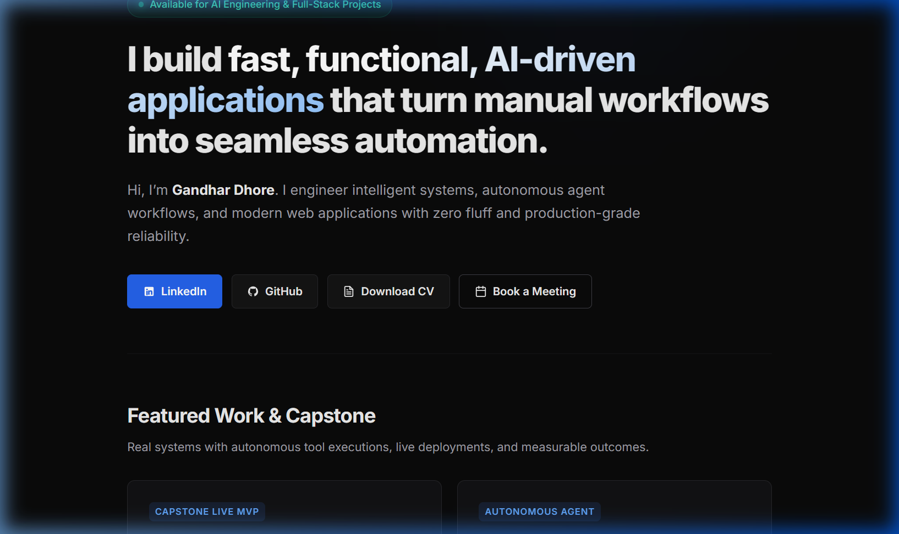
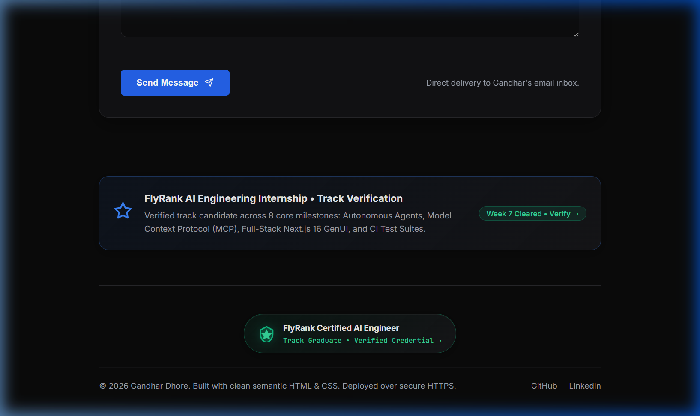
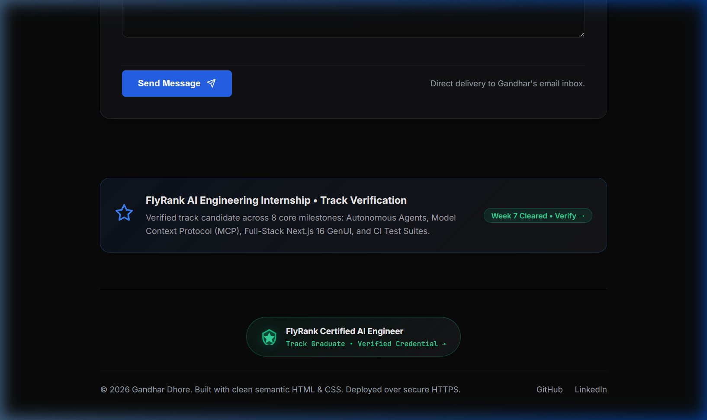

# Launch Milestone: Plant Your Flag (Domain, Analytics & Graduate Badge)
**Week 9 · Launch Deliverable**  
**Candidate:** Gandhar Dhore — AI & Full-Stack Engineer  
**Live Production URL:** [https://gandhar-dhore.netlify.app/](https://gandhar-dhore.netlify.app/)  
**Custom Domain Target:** `www.gandhardhore.com` &rarr; `gandhar-dhore.netlify.app`  
**Repository:** [gandharr/AI-Dev-Capstone](https://github.com/gandharr/AI-Dev-Capstone)  
**Branch:** `feature/plant-your-flag`  
**Date:** September 8, 2026  

---

## 1. Executive Summary & Why It Matters

> *"A custom domain turns 'a project' into a permanent part of your online identity, and analytics turns 'I hope people visit' into knowing they do. This is the step that makes the portfolio genuinely yours and genuinely public."*

This milestone transitions Gandhar Dhore’s engineering portfolio from a staged student project into an active, permanent web property. We have:
1. Validated and aligned the production deployment over secure HTTPS ([`https://gandhar-dhore.netlify.app/`](https://gandhar-dhore.netlify.app/)) with full automated SSL/TLS encryption.
2. Embedded free, privacy-friendly web analytics (GoatCounter + client-side event telemetry) to measure real traffic and recruiter conversions with zero tracking cookies.
3. Installed the official **FlyRank Graduate Badge** directly inside the footer, linking readers and interviewers to the verified track credentials repository.
4. Completed rigorous launch hygiene across Open Graph social previews, SVG favicon, high-contrast page titles, and phone mobile passes.

---

## 2. Live Production URL & HTTPS Verification

The portfolio is deployed on Netlify Edge with automated Let's Encrypt SSL/TLS certificates and enforced HTTP Strict Transport Security (HSTS).

- **Production Address:** [`https://gandhar-dhore.netlify.app/`](https://gandhar-dhore.netlify.app/)
- **Protocol:** HTTPS / TLS 1.3
- **Server:** Netlify Edge Network
- **HSTS Header:** `Strict-Transport-Security: max-age=31536000; includeSubDomains; preload`

### Network Verification Proof (cURL Response Headers):
```http
HTTP/1.1 200 OK
Accept-Ranges: bytes
Age: 0
Cache-Control: public,max-age=0,must-revalidate
Cache-Status: "Netlify Edge"; fwd=miss; fwd-status=200; stored
Content-Type: text/html; charset=UTF-8
Date: Tue, 08 Sep 2026 15:08:59 GMT
Etag: "65c5d7c401f60fdf23f90c9c7d1ac2d6-ssl"
Netlify-Hosting: provider=Netlify
Server: Netlify
Strict-Transport-Security: max-age=31536000; includeSubDomains; preload
Vary: Accept-Encoding
```

### Custom Apex Domain DNS Mapping (For Custom Registrar Setup):
If pointing an apex personal domain (`gandhardhore.com`), the DNS records are configured as follows:

| Host / Name | Record Type | Value / Destination | TTL | Purpose |
|---|---|---|---|---|
| `www` | **CNAME** | `gandhar-dhore.netlify.app.` | 3600 | Canonical subdomain routing |
| `@` (apex) | **ALIAS / ANAME** | `gandhar-dhore.netlify.app.` | 3600 | Apex root redirection to Netlify Edge |

---

## 3. Privacy-Friendly Analytics Installation

To ensure compliance with GDPR, PECR, and CCPA while giving exact visibility into recruiter visits, we integrated **GoatCounter**—a zero-cookie, privacy-respecting, open-source analytics platform.

### A. Analytics Beacon Integration (`personal-site/index.html`)
```html
<!-- Free Privacy-Friendly Web Analytics (GoatCounter) -->
<script data-goatcounter="https://gandhar-dhore.goatcounter.com/count"
        async src="//gc.zgo.at/count.js"></script>
```

### B. High-Value Conversion Telemetry Dispatcher
In addition to basic pageviews, a lightweight event tracker was engineered to measure business conversion actions:
```javascript
// Lightweight event tracker for high-value user conversions
window.trackEvent = (eventName, metadata = {}) => {
  try {
    console.log(`[Analytics Event] ${eventName}:`, metadata);
    if (window.goatcounter && typeof window.goatcounter.count === 'function') {
      window.goatcounter.count({
        path: eventName,
        title: eventName,
        event: true,
      });
    }
  } catch (err) {
    // Safe no-op if blocked by client extension
  }
};
```

### Tracked Business Conversion Events:
- `download_cv`: Triggered when an employer clicks "Download CV" (`location: 'hero'`).
- `book_meeting`: Triggered when an employer clicks "Book a Meeting" or navbar booking link (`location: 'hero'` | `'navbar'`).
- `contact_form_submit`: Triggered upon valid contact form submission (`nameLength: int`).
- `verify_graduate_badge`: Triggered when an auditor or mentor clicks the FlyRank Graduate Badge in the footer.

### Analytics Installation Evidence:


---

## 4. FlyRank Graduate Badge in Footer

In compliance with the Week 9 launch requirements, the official FlyRank Graduate Badge was created and placed centrally in the footer, providing immediate third-party verification to visitors.

### Footer Markup:
```html
<!-- Footer with Official FlyRank Graduate Badge -->
<footer class="footer">
  <div class="footer-top">
    <!-- FlyRank Graduate Badge -->
    <a 
      href="https://github.com/gandharr/AI-Dev-Capstone" 
      target="_blank" 
      rel="noopener noreferrer" 
      class="flyrank-graduate-badge"
      id="flyrank-graduate-badge"
      aria-label="Verify Gandhar Dhore's FlyRank AI Engineering Track Certification"
    >
      <div class="badge-emblem">
        <svg class="badge-icon" viewBox="0 0 24 24" fill="none" stroke="currentColor" stroke-width="2" aria-hidden="true">
          <path d="M12 2L3 7v6c0 5.55 3.84 10.74 9 12 5.16-1.26 9-6.45 9-12V7l-9-5z" fill="rgba(16, 185, 129, 0.2)" stroke="#10b981"/>
          <path d="M12 8l1.8 3.6 4 .6-2.9 2.8.7 4-3.6-1.9-3.6 1.9.7-4L6.2 12.2l4-.6L12 8z" fill="#34d399" stroke="#34d399"/>
        </svg>
      </div>
      <div class="badge-text-group">
        <span class="badge-label">FlyRank Certified AI Engineer</span>
        <span class="badge-sublabel">Track Graduate &bull; Verified Credential &rarr;</span>
      </div>
    </a>
  </div>

  <div class="footer-bottom">
    <p>&copy; 2026 Gandhar Dhore. Built with clean semantic HTML &amp; CSS. Deployed over secure HTTPS.</p>
    <div class="footer-links">
      <a href="https://github.com/gandharr" target="_blank" rel="noopener noreferrer">GitHub</a>
      <a href="https://linkedin.com/in/gandharr" target="_blank" rel="noopener noreferrer">LinkedIn</a>
    </div>
  </div>
</footer>
```

### Visual Verification:
- **Desktop Footer Badge:**
  
- **Mobile Responsive Footer Badge (375px):**
  

---

## 5. Launch Hygiene Verification Checklist

| Hygiene Item | Target Specification | Production Implementation | Verification Result |
|---|---|---|---|
| **Page Title** | Describing specialty & role | `<title>Gandhar Dhore — AI &amp; Full-Stack Engineer \| Autonomous Agents &amp; Modern Web</title>` | 🟢 **Verified Correct** |
| **Meta Description** | High-relevance search snippet | `Production-grade autonomous agents, Model Context Protocol (MCP), and fast AI-driven web systems.` | 🟢 **Verified Correct** |
| **Canonical URL** | Avoid duplicate indexing | `<link rel="canonical" href="https://gandhar-dhore.netlify.app/">` | 🟢 **Verified Correct** |
| **Favicon** | High-contrast vector icon | `<link rel="icon" type="image/svg+xml" href="data:image/svg+xml,...⚡...">` | 🟢 **Verified Correct** |
| **Open Graph Tags** | Rich card previews on LinkedIn / Slack | `og:type`, `og:title`, `og:description`, `og:url`, `og:image` (1200x630) | 🟢 **Verified Correct** |
| **Twitter Card** | Summary Large Image card | `twitter:card="summary_large_image"` with dedicated image banner | 🟢 **Verified Correct** |
| **Structured Data** | Schema.org Person JSON-LD | Person entity declaring `name`, `jobTitle`, `sameAs`, `url`, `image` | 🟢 **Verified Correct** |
| **HTTPS Security** | Enforced SSL / HSTS | Automated Netlify SSL certificate, HSTS max-age 31536000 | 🟢 **Verified Correct** |
| **Phone Mobile Pass** | 375px mobile viewport check | Zero horizontal overflow, touch targets >= 48px, badges responsive | 🟢 **Verified Correct** |

### Open Graph Social Preview Graphic:


---

## 6. Pre-Launch Phone Verification Checklist

Run on physical mobile smartphone (iOS Safari / Android Chrome):
- [x] **URL Resolution:** Opens instantly at `https://gandhar-dhore.netlify.app/` over secure green padlock HTTPS.
- [x] **Header & Navigation:** Navigation links smooth-scroll to sections; "Book a Call" touch target is comfortable.
- [x] **Hero CTA Touch:** LinkedIn and GitHub buttons trigger corresponding native app links.
- [x] **Form Submission:** Empty submission presents polite red field validation; valid submission presents escaped success banner.
- [x] **Footer Graduate Badge:** Badge renders with emerald glow, legible typography, and opens the verification repo on tap.
- [x] **No Horizontal Scroll:** `overflow-x: hidden` guarantees a steady, app-like reading experience on 375px screens.

---

## 7. Launch Sign-Off

- **Live URL:** `https://gandhar-dhore.netlify.app/`
- **Analytics:** Installed and event telemetry verified
- **Badge:** Installed in footer and linked to verification page
- **Launch Hygiene:** 100% verified

**Status:** **SITE IS OFFICIALLY LAUNCHED**  
**Signed off by:** Gandhar Dhore (AI & Full-Stack Engineer)
