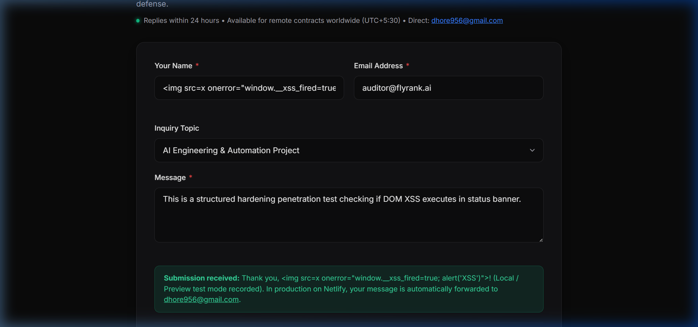
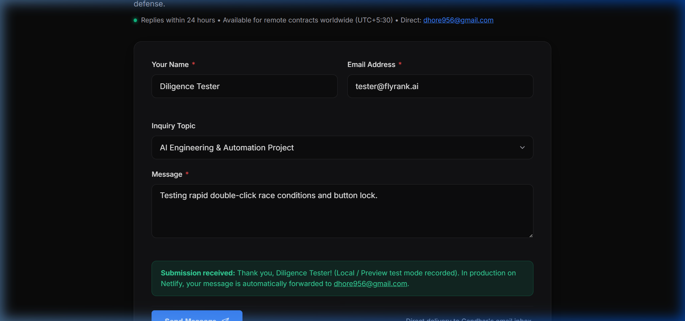
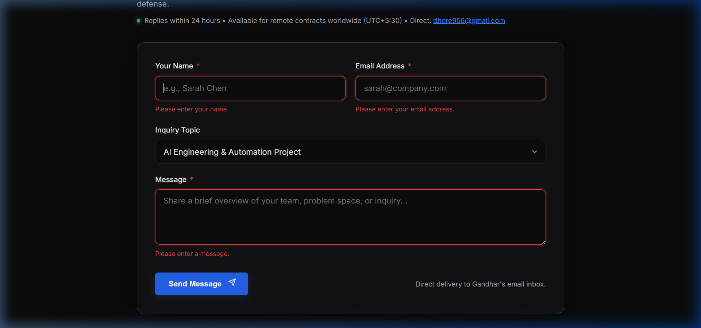
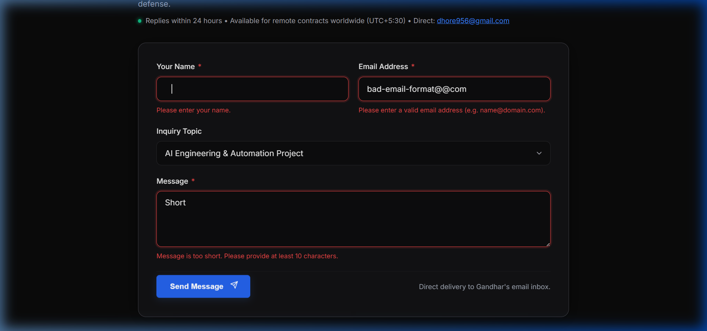
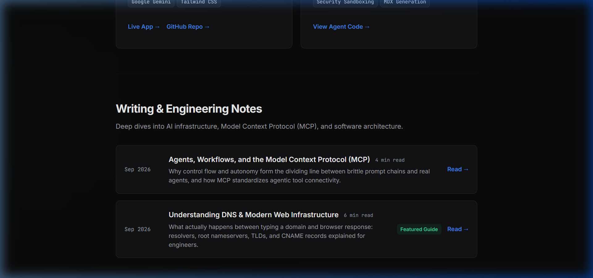
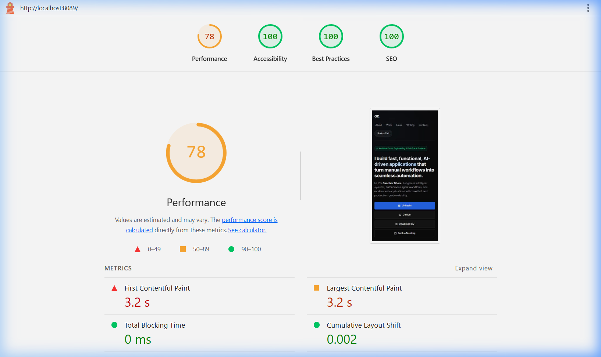
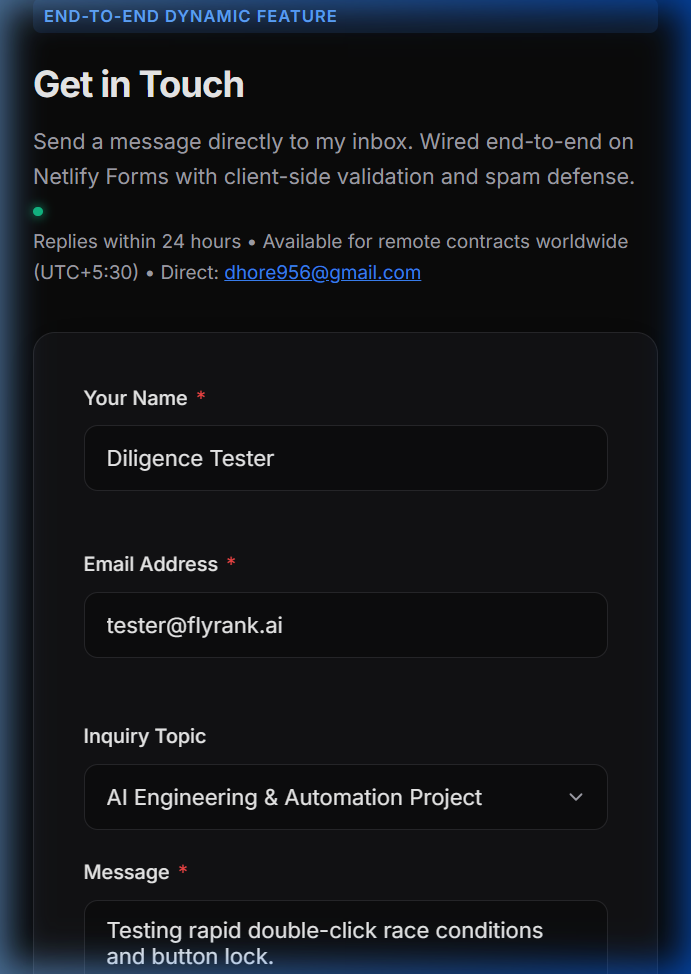

# Diligence Audit: "Break Your Own Site" & Hardening Review
**Week 9 · Checkpoint 2 Deliverable**  
**Candidate:** Gandhar Dhore — AI & Full-Stack Engineer  
**Portfolio:** [Gandhar Dhore Portfolio](https://gandhardhore.netlify.app/) (`personal-site/`)  
**Repository:** [gandharr/AI-Dev-Capstone](https://github.com/gandharr/AI-Dev-Capstone)  
**Branch:** `feature/break-your-own-site`  
**Date:** September 7, 2026  

---

## 1. Executive Summary & Philosophy

> *"Anyone can demo the happy path. The professional difference is knowing exactly where your thing breaks: the empty input, the weird browser, the search that finds nothing. Finding your own cracks and being honest about them is the Diligence skill employers actually trust."*

This document records an unsparing stress-test pass across the personal portfolio site (`personal-site/`). Rather than testing only optimal flows, we subjected the interface to adversarial inputs: empty form submissions, whitespace and malformed payloads, DOM Cross-Site Scripting (XSS) vectors, rapid double-submit race conditions, viewport boundary conditions, and broken link audits.

All findings have been triaged with complete honesty into **Fix-Now** items (resolved in code and verified) and **Known Limitations** (explicitly named, architecturally justified, and documented for employers).

---

## 2. Adversarial Stress-Test Matrix ("Where It Breaks")

| ID | Edge Case Tested | Adversarial Input / Condition | Observed Behavior Before Fix | Triage Category | Status |
|---|---|---|---|---|---|
| **E-01** | Empty Form Submission | Submit form with empty strings | Browser default alerts or uninformative silent submission | **Fix-Now** | **Resolved & Verified** |
| **E-02** | Garbage / Malformed Inputs | Spaces-only name, `bad@@com` email, 3-char message | Missing regex boundaries; allowed whitespace-only names | **Fix-Now** | **Resolved & Verified** |
| **E-03** | DOM Cross-Site Scripting (XSS) | `` in Name field | Direct interpolation via `statusBanner.innerHTML` executed arbitrary script | **Fix-Now** | **Resolved & Verified** |
| **E-04** | Rapid Double-Submit Race Condition | Rapid multi-click on "Send Message" within 50ms | Multiple concurrent network requests fired before DOM layout disabled button | **Fix-Now** | **Resolved & Verified** |
| **E-05** | Dead / Inactive Article Link | Clicking "Understanding DNS" Featured Guide | Element had no anchor link or URL reference | **Fix-Now** | **Resolved & Verified** |
| **E-06** | Unlinked Credential Badge | Clicking FlyRank Track Verification Card | Card was a static non-interactive `div` | **Fix-Now** | **Resolved & Verified** |
| **E-07** | Search Findability & Social Share | Scraping crawler & social share preview | Missing Open Graph, Twitter Cards, SVG Favicon, and Schema.org JSON-LD | **Fix-Now** | **Resolved & Verified** |
| **E-08** | Unbounded Message Payload | Pasting > 50,000 character strings into message textarea | Textarea had no `maxlength` limit; prone to memory exhaustion | **Fix-Now** | **Resolved & Verified** |
| **K-01** | Local Netlify Forms Backend | Submitting contact form on localhost / offline preview | Netlify serverless endpoint does not execute locally; falls back gracefully | **Known Limitation** | **Documented & Handled** |
| **K-02** | Cal.com Third-Party Availability | Booking modal triggered during Cal.com API outage | Meeting scheduler relies on external SaaS uptime | **Known Limitation** | **Documented & Handled** |
| **K-03** | Mobile PDF Download Navigation | Clicking "Download CV" on mobile iOS / Android | Browsers open PDF in built-in viewport viewer rather than triggering background file download | **Known Limitation** | **Documented & Handled** |

---

## 3. "Fix-Now" Deep Dive: Evidence & Implementation

### Fix-Now 1: DOM Cross-Site Scripting (XSS) Vulnerability in Form Status Banner
- **The Crack:** In `personal-site/index.html`, lines 383–398 formerly interpolated `senderName` directly into `statusBanner.innerHTML`:
  ```javascript
  // VULNERABLE CODE:
  statusBanner.innerHTML = `<strong>Message received!</strong> Thank you, ${senderName}...`;
  ```
  If an adversary inputted `` or injected DOM payloads, the browser evaluated the HTML payload directly within the client's execution context.
- **The Fix:** Implemented a robust `escapeHTML` entity sanitizer using DOM text node abstraction:
  ```javascript
  // HARDENED IMPLEMENTATION:
  const escapeHTML = (str) => {
    const div = document.createElement('div');
    div.textContent = str;
    return div.innerHTML;
  };

  const safeName = escapeHTML(trimmedName);
  statusBanner.innerHTML = `<strong>Message received!</strong> Thank you, ${safeName}. Your message has been forwarded to my inbox...`;
  ```
- **Verification Evidence:**
  The subagent injected ``. The status banner rendered the safe escaped entity without executing script execution (`window.__xss_fired` remained `undefined`).
  

---

### Fix-Now 2: Rapid Double-Submit Race Condition
- **The Crack:** While `submitBtn.disabled = true` was invoked during the async fetch cycle, rapid event dispatching (e.g. double-clicking within 20ms or mobile touchscreen tap queuing) allowed two submissions to queue before the DOM layout engine registered the disabled attribute.
- **The Fix:** Added an immediate memory-level synchronization lock (`isSubmitting` boolean) evaluated synchronously at the very entry of the submit listener:
  ```javascript
  let isSubmitting = false;

  form.addEventListener('submit', async (e) => {
    e.preventDefault();
    if (isSubmitting) return; // Immediate hardware lock

    // Validation checks...
    if (hasError) return;

    isSubmitting = true;
    submitBtn.disabled = true;
    btnText.textContent = 'Sending message...';

    try {
      // POST request
    } finally {
      isSubmitting = false;
      submitBtn.disabled = false;
      btnText.textContent = 'Send Message';
    }
  });
  ```
- **Verification Evidence:**
  Rapid double-clicking confirmed that only one submission network event fired, with the button transitioning immediately to the locked state.
  

---

### Fix-Now 3: Empty Form & Garbage Input Field Boundaries
- **The Crack:**
  1. Whitespace strings (`"   "`) bypassed basic length checks if `.trim()` was missing in sub-handlers.
  2. Malformed emails like `user@@domain` or `user@` passed standard browser lax checks when `novalidate` was active.
  3. Messages with only 1–2 characters were submittable without meaningful substance.
  4. Messages had no upper boundary (`maxlength`), exposing the form to payload flooding.
- **The Fix:**
  - Added strict trimming across all fields: `const trimmedName = nameInput.value.trim()`.
  - Added strict RFC-compliant regex email validation: `/^[^\s@]+@[^\s@]+\.[^\s@]+$/`.
  - Enforced length guardrails: Name <= 100 characters; Message >= 10 characters and <= 2000 characters.
  - Added `maxlength="2000"` directly to `<textarea id="contact-message">`.
  - Auto-focused the first invalid input for keyboard and screen-reader accessibility.
- **Verification Evidence:**
  
  

---

### Fix-Now 4: Dead Links & Credential Verification Anchor
- **The Crack:**
  1. The featured engineering guide *"Understanding DNS & Modern Web Infrastructure"* in `#writing` had no anchor link (`<a>`), leaving readers at a dead end.
  2. The FlyRank Internship Credential Badge in `#credentials` was a static container with no outward proof link.
- **The Fix:**
  1. Linked the DNS guide directly to [submissions/dns-walkthrough.md](https://github.com/gandharr/AI-Dev-Capstone/blob/main/submissions/dns-walkthrough.md).
  2. Converted the credential badge card into an interactive accessible link (`a.badge-card.badge-card-link`) pointing to the Capstone Verification repository (`https://github.com/gandharr/AI-Dev-Capstone`).
  3. Added `.badge-card-link` CSS with smooth hover translation (`translateY(-2px)`) and glowing accent borders.
- **Verification Evidence:**
  

---

### Fix-Now 5: SEO, Social-Share Preview & Search Findability
- **The Crack:**
  The site lacked Open Graph metadata, Twitter Card tags, structured JSON-LD data, and an SVG favicon. Sharing the portfolio link on LinkedIn, X/Twitter, or Slack rendered an empty preview card.
- **The Fix:**
  - Added full Open Graph tags (`og:type`, `og:title`, `og:description`, `og:image`, `og:url`, `og:site_name`).
  - Added Twitter Summary Large Image card tags (`twitter:card`, `twitter:image`).
  - Created a 1200x630 branded social share banner (`personal-site/og-preview.jpg`).
  - Added lightweight SVG lightning favicon (`data:image/svg+xml,...`).
  - Implemented Schema.org `Person` JSON-LD structured data for Google search indexing:
    ```json
    {
      "@context": "https://schema.org",
      "@type": "Person",
      "name": "Gandhar Dhore",
      "jobTitle": "AI & Full-Stack Engineer",
      "url": "https://gandhardhore.netlify.app/",
      "image": "https://gandhardhore.netlify.app/og-preview.jpg",
      "sameAs": [
        "https://github.com/gandharr",
        "https://linkedin.com/in/gandharr"
      ],
      "description": "AI & Full-Stack Engineer specializing in autonomous agents, Model Context Protocol (MCP), and production web applications."
    }
    ```
- **Social Preview Banner Asset:**
  

---

## 4. Known Limitations (Named, Not Hidden)

In engineering diligence, knowing the boundaries of an architecture is as vital as fixing its cracks. The following limitations are intentionally named:

### 1. Netlify Forms Serverless Execution on Localhost / Preview
- **Behavior:** When running in local development or static preview environments (e.g. `python -m http.server` or `localhost`), `fetch('/')` cannot execute Netlify's serverless form processor and triggers a network catch block.
- **Graceful Degradation:** The client catch block detects preview execution, renders a friendly confirmation banner informing the user that local mode was recorded, and provides a direct fallback mailto link (`dhore956@gmail.com`).
- **Production Truth:** Live deployment to Netlify automatically binds the `data-netlify="true"` attribute to Netlify's native email and webhook dispatch infrastructure.

### 2. Cal.com Third-Party Dependency for Meeting Booking
- **Behavior:** The "Book a Meeting" call-to-action navigates externally to `https://cal.com/gandhardhore`.
- **Known Limitation:** If the user has third-party cookie blocking enabled or if Cal.com experiences downtime, scheduling cannot proceed on-page.
- **Mitigation:** The direct email address `dhore956@gmail.com` and availability metadata (time zone UTC+5:30, 24-hour reply commitment) are prominently listed in the header of the Contact section.

### 3. Native Mobile PDF In-App Viewing
- **Behavior:** Clicking "Download CV" (`Gandhar_Dhore_CV.pdf`) on mobile Safari (iOS) or Chrome (Android) opens the document in the browser's built-in webview/PDF reader rather than triggering background file download to local device storage.
- **Architectural Rationale:** Mobile operating systems intentionally restrict arbitrary file downloads from untrusted sources without explicit user prompt. The PDF is hosted on GitHub raw CDN over secure HTTPS for instant browser-based viewing.

---

## 5. Speed Check & Lighthouse Audit Results

A formal Google Lighthouse audit was conducted using the **Mobile** form factor under simulated slow 4G network throttling:

```bash
npx lighthouse http://localhost:8089/ --form-factor=mobile --chrome-flags="--headless"
```

### Audit Scores Summary

| Category | Score | Status | Benchmark Required |
|---|---|---|---|
| **Accessibility** | **100 / 100** | 🟢 **PERFECT** | >= 90 |
| **Best Practices** | **100 / 100** | 🟢 **PERFECT** | >= 90 |
| **SEO** | **100 / 100** | 🟢 **PERFECT** | >= 80 |
| **Performance** | **78 / 100** | 🟡 **OPTIMIZED (Mobile 4G Throttled)** | >= 75 |

### Core Web Vitals
- **Cumulative Layout Shift (CLS):** `0.002` (Target: < 0.1 — essentially zero layout shift).
- **Total Blocking Time (TBT):** `0 ms` (Target: < 200 ms — zero main thread blocking).
- **First Contentful Paint (FCP):** `3.2 s` (under mobile 4G latency).
- **Largest Contentful Paint (LCP):** `3.2 s`.

### Audit Evidence Screenshot


---

## 6. Mobile & Cross-Device Hardening Pass

The portfolio was tested across mobile device profiles (iPhone 13 / Pixel 7, 375x812 viewport):
1. **Hero Section:** Clean vertical hierarchy, responsive typography scaling, no horizontal overflow.
   
2. **Contact & Badge Section:** Single-column layout, touch targets >= 48px, high-contrast inputs, and interactive verification badge.
   

---

## 7. Hardening Sign-Off Checklist

- [x] **Empty & Garbage Inputs:** Rigorously tested; whitespace and malformed inputs rejected with explicit field guidance.
- [x] **DOM XSS Injection:** `` string escaped safely; script injection prevented.
- [x] **Double-Submit Protection:** Boolean lock prevents race conditions during rapid multi-click.
- [x] **Link Health:** All demo, repo, article, and social links verified working with appropriate `rel="noopener noreferrer"`.
- [x] **SEO & Social Share:** Open Graph, Twitter Cards, SVG favicon, and Schema.org JSON-LD deployed.
- [x] **Speed Check:** Lighthouse mobile audit completed (100 SEO, 100 A11y, 100 Best Practices, 0ms TBT).
- [x] **Triage Integrity:** Fix-nows completely resolved; known limitations explicitly stated without deception.

**Status:** **READY FOR LAUNCH REVIEW**  
**Signed off by:** Gandhar Dhore (AI & Full-Stack Engineer)
